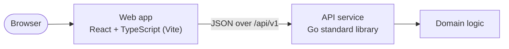

# <Product name>

<!-- One paragraph: what it does, for whom, and the two or three things that make it solid
(e.g. strict API contract, full test pyramid, containerised). No marketing language. -->

## Features

<!-- Bullet list of user-visible capabilities, mapped from the spec. Mark optional features
that were implemented. -->

## Architecture



<!-- Explain the request flow in 3–6 sentences: how the frontend calls the API (proxy in
dev, nginx in containers), backend layers (httpapi → domain, composition root), error
model (RFC 9457 problem details with codes), configuration, observability. -->

### Project structure

```text
<!-- annotated tree, 2–3 levels -->
```

## Tech stack

| Area | Choice | Why |
|---|---|---|
| Backend | Go <version>, standard library only | … |
| Frontend | React <version>, TypeScript <version>, Vite <version>, CSS Modules | … |
| Testing | Go `testing`, Vitest, Testing Library, MSW, Playwright | … |
| Delivery | Make, Docker (distroless, nginx), GitHub Actions | … |

## Getting started

### Prerequisites

| Tool | Version | Needed for |
|---|---|---|
| Go | ≥ <version> | backend |
| Node.js / npm | ≥ <version> (see `.nvmrc`) | frontend |
| Docker | recent, with Compose v2 | containers (optional) |
| golangci-lint | v2 (optional) | `make lint` |

### Quick start with Docker

```bash
make docker-up        # web on http://localhost:3000, API on http://localhost:8080
make docker-down
```

### Local development

```bash
make setup            # install dependencies and the Playwright browser
make dev              # API on :8080 and web app on :5173 (proxies /api)
```

### Running the backend and frontend separately

```bash
make run-backend      # or: cd backend && go run ./cmd/api
make run-frontend     # or: cd frontend && npm run dev
```

## Configuration

### Backend

| Variable | Default | Description |
|---|---|---|

### Frontend

| Variable | Default | Description |
|---|---|---|

## API

Base URL: `http://localhost:8080/api/v1` (through the web app: `/api/v1`). The full
contract is in [`backend/api/openapi.yaml`](backend/api/openapi.yaml). Errors use
[RFC 9457](https://www.rfc-editor.org/rfc/rfc9457) problem details:

```json
<!-- a real error response captured with curl -->
```

| Status | Code | When |
|---|---|---|

### <METHOD> <path>

<!-- Purpose, request schema (table), response schema, then examples: -->

```bash
curl -s -i -X POST http://localhost:8080/api/v1/... \
  -H 'Content-Type: application/json' \
  -d '{...}'
```

```http
HTTP/1.1 200 OK
Content-Type: application/json; charset=utf-8

{ ... }
```

### Health

```bash
curl -s http://localhost:8080/healthz
```

## Testing

| Layer | Tooling | Command |
|---|---|---|
| Backend unit and handler tests | Go `testing`, `httptest` | `make test-backend` |
| API black-box tests | Go, real HTTP | `cd backend && go test ./test/e2e/...` |
| Frontend unit and component tests | Vitest, Testing Library, MSW | `make test-frontend` |
| Browser end-to-end | Playwright (desktop and mobile) | `make test-e2e` |
| Everything CI runs | | `make verify` |

Coverage (from [`docs/coverage.md`](docs/coverage.md)): backend <x>%, frontend <y>% lines.
Run `make coverage` and open `coverage/backend/index.html` or `coverage/frontend/index.html`.

## Design decisions

<!-- One short paragraph per decision with a link to its ADR: dependency policy, layering
and SOLID boundaries, API shape and error model, data representation, validation split,
state management, accessibility approach, container topology, testing strategy. -->

## Assumptions

<!-- Every assumption made where the requirements were silent (from the plan), phrased as
facts about the implementation. -->

## Limitations and next steps

<!-- Honest list: what is intentionally out of scope and what would come next. -->

## Troubleshooting

| Symptom | Fix |
|---|---|
| `address already in use` on 8080 or 5173 | stop the other process (`lsof -i :8080`) or set `HTTP_ADDR` / use another Vite port |
| Playwright cannot find a browser | `cd frontend && npx playwright install chromium` |
| `make lint` fails with "golangci-lint: command not found" | install golangci-lint v2 (`brew install golangci-lint`) |
| Docker commands fail | start Docker Desktop and retry `make docker-up` |
