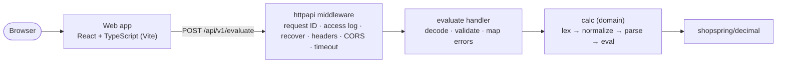

# Calculator

A web calculator: a React + TypeScript single-page app (`frontend/`) that sends arithmetic
expressions to a Go REST microservice (`backend/`), which lexes, normalizes, parses and
evaluates them with exact decimal arithmetic. The result appears while you type. The API
has a strict OpenAPI contract with RFC 9457 problem details, every layer is tested (unit,
handler, fuzz, black-box API, component, browser end-to-end), and the stack runs with one
command in containers.

**Try it online:** <https://thunderous-sopapillas-53e844.netlify.app/> (the web app on
Netlify, proxying `/api` to the Go service on Render, both on free plans as described in
[docs/deployment.md](docs/deployment.md); the first request after a quiet period may take
a few seconds while the API wakes up).

## Features

- Operators `+ - * /`, exponentiation `^` (right-associative, binds tighter than unary
  minus: `-2^2` = `-4`), unary minus, parentheses and `sqrt(x)`.
- Calculator-style postfix percent: `x%` is `x/100`, except as the direct right operand of
  `+` or `-`, where `200+10%` = `220`.
- Exact decimal arithmetic: `0.1+0.2` = `0.3`; results are returned as JSON strings, so no
  precision is lost in transit.
- Live result 150 ms after typing stops; superseded requests are cancelled; "Calculating…"
  appears after 300 ms without a response.
- Enter or `=` commits: the result replaces the input (negatives as `(-5)`) and the
  calculation joins an in-memory history of the last 20 entries. `⌫` deletes one character;
  `C` or Escape clears.
- Keypad with 44 px keys; on touch devices the keypad is the input method and the soft
  keyboard stays hidden. From 48 rem wide the calculator is one centred panel with the
  display across the top, the keypad on the left and History on the right, and keys and
  type that scale with the window; narrower screens keep a single column.
- The input is focused when the page opens, and printable keys, Backspace and Escape reach
  it from anywhere on the page, so you can type without clicking first.
- Lenient normalization: trailing operators and a trailing `.` are dropped, unmatched `(`
  are closed, and the evaluated expression is echoed ("Evaluated as 2*(3+4)").
- Every error is machine-readable: RFC 9457 problem details with a stable `code` and, for
  validation errors, a 0-based character position.
- Styled as a physical calculator (dark LCD display, keys with depth grouped by colour,
  paper-tape history) using system fonts and design tokens with light and dark values;
  WCAG 2.2 AA (checked with axe), responsive from 320 px.

## Architecture



The web app calls `/api/v1` on its own origin: in development Vite proxies `/api` to the Go
service on port 8080; in containers nginx serves the static build and proxies `/api/` to
`backend:8080`. In the backend, `cmd/api` reads the environment into a typed config,
`internal/app` (the composition root) wires the domain `calc.Calculator` into the
`internal/httpapi` handler, and `internal/server` runs the `http.Server` with timeouts and
graceful shutdown. The handler decodes and validates the body, calls the domain, and maps
domain errors to problem documents: 400 `VALIDATION_FAILED` with one `errors[]` entry for
expressions that cannot be parsed, 422 with a domain code for expressions that have no
value within the limits. Every response carries `X-Request-ID`, `Cache-Control: no-store`
and the security headers; every request produces one structured `log/slog` line.

### Project structure

```text
backend/                     Go module github.com/aksh/calculator/backend
  cmd/api/                   main: flags, environment, signals, -healthcheck
  internal/app/              composition root: config → http.Handler
  internal/calc/             pure domain: lexer, normalizer, parser, AST, evaluator, tables
  internal/config/           typed configuration from the environment, validated at startup
  internal/httpapi/          router, evaluate handler, DTOs, problem responses, middleware
  internal/server/           http.Server lifecycle and graceful shutdown
  test/e2e/                  black-box API tests over real HTTP
  api/openapi.yaml           API contract (OpenAPI 3.1)
  Dockerfile, .golangci.yml
frontend/                    Vite + React + TypeScript
  src/api/                   typed HTTP client, DTOs, response validation, error mapping
  src/app/                   App shell and error boundary
  src/features/calculator/   reducer (model.ts), hook (useCalculator.ts), components
  src/lib/                   environment parsing, colour-contrast maths
  src/styles/                design tokens and global styles
  src/test/                  Vitest setup, MSW handlers, render helpers
  e2e/                       Playwright specs (desktop and mobile)
  nginx.conf, Dockerfile, playwright.config.ts, vitest.config.ts, vite.config.ts
scripts/                     dev.sh (make dev), coverage-report.sh (docs/coverage.md)
docs/                        adr/ (decision records), coverage.md, prompts.md, deployment.md
prompts/                     the prompts that produced the tooling and the spec
specs/                       product spec and implementation plan
compose.yaml                 two-container stack (backend + web)
Makefile                     every developer task (make help)
.github/workflows/ci.yml     CI: hygiene, backend, frontend, e2e, docker
```

## Tech stack

| Area     | Choice                                                                                                            | Why                                                                                                                   |
| -------- | ----------------------------------------------------------------------------------------------------------------- | --------------------------------------------------------------------------------------------------------------------- |
| Backend  | Go 1.27, standard library (`net/http`, `encoding/json`, `log/slog`) plus `shopspring/decimal` 1.4.0               | Explicit routing, middleware and validation with nothing to audit but one module; exact decimals instead of `float64` |
| Frontend | React 19.2, TypeScript 6.0, Vite 8.3, CSS Modules with custom properties                                          | Strict types, fast builds, no UI kit or state library to learn; runtime dependencies are `react` and `react-dom` only |
| Testing  | Go `testing` (unit, fuzz, benchmark, `httptest`), Vitest 5.0, Testing Library, MSW 2.15, Playwright 1.63 with axe | One tool per layer; the network is faked at the HTTP boundary and journeys run against the real backend               |
| Delivery | Make, Docker (distroless static image, unprivileged nginx), Compose v2, GitHub Actions                            | One entry point for every task; production-shaped containers; CI mirrors `make verify`                                |

## Getting started

### Run it with one command (Docker only)

The only requirement is Docker with Compose v2 (Docker Desktop on macOS or Windows,
Docker Engine on Linux). Go, Node.js and npm are not needed on your machine: the images
build everything inside containers.

```bash
git clone https://github.com/uaskh/Calculator.git
cd Calculator
docker compose up --build --wait
```

Then open <http://localhost:3000>. The API is also published on
<http://localhost:8080> so the `curl` examples below work as written.

The command builds both images (two to four minutes the first time, seconds afterwards),
starts the API, waits for its health check, then starts the web container and waits for
nginx. It works the same in a macOS or Linux terminal, in Windows PowerShell and in
Git Bash. To stop and remove the containers:

```bash
docker compose down
```

`make docker-up` and `make docker-down` are shorthands for the same two commands on
systems that have `make`.

To put the app on the public internet at no cost, follow
[docs/deployment.md](docs/deployment.md) (Render for the API, Netlify for the web app);
that path needs no local toolchain either.

### Developer toolchain (only for changing the code)

| Tool          | Version                    | Needed for                 |
| ------------- | -------------------------- | -------------------------- |
| Go            | ≥ 1.27 (`backend/go.mod`)  | backend                    |
| Node.js / npm | ≥ 26.8 / 11 (see `.nvmrc`) | frontend                   |
| Docker        | recent, with Compose v2    | containers                 |
| golangci-lint | v2.13 (optional)           | `make lint`, `make verify` |
| GNU Make      | 3.81 or newer              | the `make` targets below   |

### Local development

```bash
make setup            # go mod verify, npm ci, Playwright Chromium
make dev              # API on :8080 and web app on :5173 (proxies /api); Ctrl+C stops both
```

Open <http://localhost:5173>. `make dev` runs the backend with `LOG_FORMAT=text` so the
access log is readable in a terminal. `make help` lists every target.

### Running the backend and frontend separately

```bash
make run-backend      # or: cd backend && go run ./cmd/api
make run-frontend     # or: cd frontend && npm run dev
```

The backend listens on `:8080`; the Vite dev server listens on `:5173` and proxies `/api`
to `API_PROXY_TARGET` (default `http://localhost:8080`). To point the dev server at
another backend: `API_PROXY_TARGET=http://localhost:9090 make run-frontend`.

## Configuration

### Backend

All variables are optional. Invalid values are reported together and stop the process at
startup.

| Variable                   | Default   | Description                                                                                                |
| -------------------------- | --------- | ---------------------------------------------------------------------------------------------------------- |
| `HTTP_ADDR`                | `:8080`   | Listen address                                                                                             |
| `HTTP_READ_HEADER_TIMEOUT` | `5s`      | `http.Server` ReadHeaderTimeout                                                                            |
| `HTTP_READ_TIMEOUT`        | `10s`     | `http.Server` ReadTimeout                                                                                  |
| `HTTP_WRITE_TIMEOUT`       | `15s`     | `http.Server` WriteTimeout; must be longer than `HTTP_REQUEST_TIMEOUT`                                     |
| `HTTP_IDLE_TIMEOUT`        | `60s`     | Keep-alive idle timeout                                                                                    |
| `HTTP_SHUTDOWN_TIMEOUT`    | `10s`     | Grace period for in-flight requests on SIGINT/SIGTERM; when it passes, open connections are closed         |
| `HTTP_SHUTDOWN_DELAY`      | `0s`      | After `/readyz` flips to 503, keep accepting connections this long before draining (`compose.yaml`: `3s`)  |
| `HTTP_REQUEST_TIMEOUT`     | `5s`      | Handler deadline; when exceeded the response is 503 `TIMEOUT`                                              |
| `HTTP_MAX_BODY_BYTES`      | `4096`    | Request body limit; larger bodies get 413 `PAYLOAD_TOO_LARGE`                                              |
| `HTTP_MAX_HEADER_BYTES`    | `1048576` | `http.Server` MaxHeaderBytes; larger request headers get 431                                               |
| `LOG_LEVEL`                | `info`    | `debug`, `info`, `warn` or `error`                                                                         |
| `LOG_FORMAT`               | `json`    | `json` or `text` (`make dev` and `make run-backend` use `text`)                                            |
| `CORS_ALLOWED_ORIGINS`     | empty     | Comma-separated exact origins (`https://app.example.com`). Empty disables CORS; `*` is rejected at startup |

### Frontend

`VITE_*` variables are read at build time (see [`frontend/.env.example`](frontend/.env.example)).

| Variable              | Default                 | Description                                                                             |
| --------------------- | ----------------------- | --------------------------------------------------------------------------------------- |
| `VITE_APP_NAME`       | `Calculator`            | Application title                                                                       |
| `VITE_API_BASE_URL`   | empty                   | Origin of the API. Empty means same origin; the code appends `/api/v1` either way       |
| `VITE_API_TIMEOUT_MS` | `10000`                 | Client-side fetch timeout; after it the UI shows the network message                    |
| `API_PROXY_TARGET`    | `http://localhost:8080` | Shell variable read by `vite.config.ts`: where the dev and preview servers proxy `/api` |

## Expression language

```text
expression := term { ("+" | "-") term }
term       := unary { ("*" | "/") unary }
unary      := "-" unary | power
power      := postfix [ "^" unary ]          right-associative; -2^2 = -(2^2)
postfix    := primary { "%" }
primary    := number | "(" expression ")" | "sqrt" "(" expression ")"
number     := digits [ "." digits ] | "." digits
```

Precedence, high to low:

| Level | Operators     | Notes                                    |
| ----- | ------------- | ---------------------------------------- |
| 1     | `%` (postfix) | `2%^2` = `0.0004`, `2^2%` = `2^0.02`     |
| 2     | `^`           | Right-associative: `2^3^2` = `512`       |
| 3     | unary `-`     | Below `^`: `-2^2` = `-4`, `(-2)^2` = `4` |
| 4     | `*` `/`       | Left-associative: `8/2/2` = `2`          |
| 5     | `+` `-`       | Left-associative: `10-4-3` = `3`         |

Rules:

- Only ASCII operators are accepted; `×`, `÷` and `−` are `INVALID_CHARACTER` (the keypad
  inserts `*`, `/`, `-`). Whitespace between tokens (space, tab) is ignored. `sqrt` is
  case-sensitive; any other identifier is `UNKNOWN_FUNCTION`. Implicit multiplication
  (`2(3)`) and unary plus (`+3`) are `UNEXPECTED_TOKEN`. Leading zeros are allowed
  (`007` = `7`).
- Percent: `x%` is `x/100` (`50%` = `0.5`, `50*10%` = `5`), except when the `%` node is the
  direct right operand of `+` or `-`: then it is a percentage of the left operand
  (`200+10%` = `220`, `200-10%` = `180`). Parentheses, an intervening operator or a unary
  minus break directness: `200+(10%)` = `200.1`, `200+10%*2` = `200.2`, `200+-10%` =
  `199.9`. Repeated `%` applies the rule to the outermost node only: `50%%` = `0.005`,
  `100+50%%` = `100.5`.
- Normalization (before parsing): leading and trailing whitespace is trimmed; a trailing
  binary operator, a trailing `.` or a trailing `(` / `sqrt(` is dropped, repeatedly;
  every unmatched `(` is closed. The evaluated text is returned as `expression`. Examples:
  `3+4*` → `3+4` = `7`; `2*(3+4` → `2*(3+4)` = `14`; `2.` → `2`; `sqrt(` and `(` → 400
  `EMPTY`. A `.` is only repairable at the very end: `2.+3` is `INVALID_NUMBER`.
- Precision: literals and every intermediate result are rounded half away from zero to 32
  decimal places; the final result to 16 places. Division, `sqrt` and fractional powers
  carry 72 guard places, so `1/3*3` = `1` and `sqrt(2)*sqrt(2)` = `2`. Magnitudes below
  `5·10^-33` become `0` (`0.5^1000` = `0`). Because exponents are evaluated values,
  `(-2)^(1/3*3)` is `INVALID_POWER`: the exponent is `0.99…9`, not `1`.
- Validation stops at the first failure in this order: `TOO_LONG` → lexing
  (`INVALID_CHARACTER`, `INVALID_NUMBER`, `UNKNOWN_FUNCTION`) → normalization → `EMPTY` →
  `TOO_DEEP` → parsing (`UNEXPECTED_TOKEN`, `UNBALANCED_PARENTHESIS`). `errors[]` always
  has exactly one entry. `position` is 0-based; the message counts from 1 (`2+()` →
  position `3`, "unexpected ')' at character 4").

Limits (constants in the code):

| Limit                                     | Value                | Error                    |
| ----------------------------------------- | -------------------- | ------------------------ |
| Expression length                         | ≤ 1,024 code points  | 400 `TOO_LONG`           |
| Nesting depth (`(` and `sqrt(`)           | ≤ 32                 | 400 `TOO_DEEP`           |
| Exponent                                  | `\|n\|` ≤ 1000       | 422 `EXPONENT_TOO_LARGE` |
| Literal, intermediate and final magnitude | `\|value\|` < 10^100 | 422 `RESULT_TOO_LARGE`   |
| Request body                              | ≤ 4 KiB              | 413 `PAYLOAD_TOO_LARGE`  |
| Handler time                              | 5 s                  | 503 `TIMEOUT`            |

The longest possible result is 118 characters; the normalized expression can reach 1,056
characters (closing parentheses added to a 1,024-character input).

## Keyboard and accessibility

- The expression input has focus when the page opens. Type the expression directly; Enter
  commits, Escape clears. When focus is on the page background or on a keypad or history
  button, printable characters, Backspace and Escape are routed to the input (appended at
  the end) and Enter on the background commits; Enter and Space on a button activate that
  button as usual. Tab order is unchanged: Tab reaches every key, and focus returns to the
  input after keypad taps, `=`, `C` and history activation. Keys with Ctrl, Alt or Cmd are
  left to the browser. On dead-key layouts, a dead key pressed outside the input only moves
  focus into it, so the browser completes the accent sequence there. There are no other
  shortcuts.
- Every keypad key is at least 44 × 44 px. Non-digit keys have accessible names ("divide",
  "multiply", "backspace", …); the `sqrt` key is named "sqrt, square root" so the visible
  label is part of the name (WCAG 2.5.3).
- The live result is an `<output aria-live="polite">`; while typing, errors are polite
  status text. On commit, errors are announced with `role="alert"` and linked to the input
  with `aria-describedby`; the input is marked `aria-invalid` only for 400 and 422 responses.
- Light and dark themes follow `prefers-color-scheme` with ≥ 4.5:1 text contrast in both
  (checked by a unit test over the design tokens and by axe in the browser suite).
  Transitions are disabled under `prefers-reduced-motion`.
- Long inputs and results scroll horizontally inside their fields; the page never scrolls
  sideways at 320 px, 412 px, 767 px, 768 px, 1280 px or 1920 px.
- Printing uses the light palette regardless of the colour scheme and omits the keypad.

## API

Base URL: `http://localhost:8080/api/v1` (through the web app: `/api/v1`). The full
contract is in [`backend/api/openapi.yaml`](backend/api/openapi.yaml). Errors use
[RFC 9457](https://www.rfc-editor.org/rfc/rfc9457) problem details
(`Content-Type: application/problem+json`):

```json
{
  "type": "about:blank",
  "title": "Bad Request",
  "status": 400,
  "detail": "unexpected ')' at character 4",
  "instance": "/api/v1/evaluate",
  "code": "VALIDATION_FAILED",
  "requestId": "090245b6808236d510cbf63c73f653d8",
  "errors": [
    {
      "field": "expression",
      "code": "UNEXPECTED_TOKEN",
      "position": 3,
      "message": "unexpected ')' at character 4"
    }
  ]
}
```

| Status | Code                     | When                                                                                                                                                                                                              |
| ------ | ------------------------ | ----------------------------------------------------------------------------------------------------------------------------------------------------------------------------------------------------------------- |
| 200    | —                        | Evaluated; body `{ "expression", "result" }`                                                                                                                                                                      |
| 400    | `MALFORMED_REQUEST`      | Invalid JSON, wrong type, unknown field, several JSON values, empty body; `errors[]` may carry `INVALID_TYPE` or `UNKNOWN_FIELD`                                                                                  |
| 400    | `VALIDATION_FAILED`      | Expression missing or unparsable; `errors[0].code` is one of `REQUIRED`, `EMPTY`, `TOO_LONG`, `TOO_DEEP`, `INVALID_CHARACTER`, `INVALID_NUMBER`, `UNEXPECTED_TOKEN`, `UNBALANCED_PARENTHESIS`, `UNKNOWN_FUNCTION` |
| 404    | `NOT_FOUND`              | Unknown path                                                                                                                                                                                                      |
| 405    | `METHOD_NOT_ALLOWED`     | Wrong method; `Allow` header lists the accepted ones                                                                                                                                                              |
| 413    | `PAYLOAD_TOO_LARGE`      | Body larger than 4 KiB                                                                                                                                                                                            |
| 415    | `UNSUPPORTED_MEDIA_TYPE` | `Content-Type` is not `application/json`                                                                                                                                                                          |
| 422    | `DIVISION_BY_ZERO`       | "Cannot divide by zero." (also `0^-1` and division by a value that rounds to 0)                                                                                                                                   |
| 422    | `NEGATIVE_SQUARE_ROOT`   | "Cannot take the square root of a negative number."                                                                                                                                                               |
| 422    | `INVALID_POWER`          | "Cannot raise a negative number to a fractional power."                                                                                                                                                           |
| 422    | `EXPONENT_TOO_LARGE`     | "Exponent must be between -1000 and 1000."                                                                                                                                                                        |
| 422    | `RESULT_TOO_LARGE`       | "Result is too large to calculate." (any literal, intermediate or final value ≥ 10^100)                                                                                                                           |
| 500    | `INTERNAL_ERROR`         | Unexpected failure; details are logged with the request ID                                                                                                                                                        |
| 503    | `TIMEOUT`                | Handler exceeded `HTTP_REQUEST_TIMEOUT`                                                                                                                                                                           |
| 503    | `NOT_READY`              | `GET /readyz` once shutdown has started                                                                                                                                                                           |

Every response carries `X-Request-ID` (a client value matching `^[A-Za-z0-9._-]{1,64}$` is
echoed; otherwise 32 hex characters are generated), `Cache-Control: no-store` and the
security headers shown in the first example below.

### POST /api/v1/evaluate

Evaluates one expression. The body must be `application/json` (a `charset` parameter is
accepted); unknown fields are rejected.

Request:

| Field        | Type   | Rules                                                |
| ------------ | ------ | ---------------------------------------------------- |
| `expression` | string | Required; ≤ 1,024 code points; see the grammar above |

Response (200):

| Field        | Type   | Meaning                                                                                                             |
| ------------ | ------ | ------------------------------------------------------------------------------------------------------------------- |
| `expression` | string | The normalized expression that was evaluated                                                                        |
| `result`     | string | Canonical decimal: optional `-`, digits, optional fraction without trailing zeros, no exponent notation, never `-0` |

Success, with normalization of an unclosed parenthesis:

```bash
curl -s -i -X POST http://localhost:8080/api/v1/evaluate \
  -H 'Content-Type: application/json' \
  -d '{"expression":"2*(3+4"}'
```

```http
HTTP/1.1 200 OK
Cache-Control: no-store
Content-Security-Policy: default-src 'none'; frame-ancestors 'none'
Content-Type: application/json; charset=utf-8
Cross-Origin-Opener-Policy: same-origin
Permissions-Policy: camera=(), microphone=(), geolocation=()
Referrer-Policy: no-referrer
X-Content-Type-Options: nosniff
X-Frame-Options: DENY
X-Request-Id: ec3b943519a86b591b3249518b5e03c1
Content-Length: 39

{"expression":"2*(3+4)","result":"14"}
```

More successful evaluations (`curl -s -X POST … -d '{"expression":"…"}'`, body only):

| Expression    | Response                                                                                                                     |
| ------------- | ---------------------------------------------------------------------------------------------------------------------------- |
| `200+10%`     | `{"expression":"200+10%","result":"220"}`                                                                                    |
| `2^0.5`       | `{"expression":"2^0.5","result":"1.414213562373095"}`                                                                        |
| `0.1+0.2`     | `{"expression":"0.1+0.2","result":"0.3"}`                                                                                    |
| `2^100`       | `{"expression":"2^100","result":"1267650600228229401496703205376"}`                                                          |
| `-2^2`        | `{"expression":"-2^2","result":"-4"}`                                                                                        |
| `3+4*`        | `{"expression":"3+4","result":"7"}`                                                                                          |
| `2.`          | `{"expression":"2","result":"2"}`                                                                                            |
| `(10^90)^0.9` | `{"expression":"(10^90)^0.9","result":"1000000000000000000000000000000000000000000000000000000000000000000000000000000000"}` |

Validation error (400) with a position:

```bash
curl -s -i -X POST http://localhost:8080/api/v1/evaluate \
  -H 'Content-Type: application/json' \
  -d '{"expression":"2+()"}'
```

```http
HTTP/1.1 400 Bad Request
Content-Type: application/problem+json

{"type":"about:blank","title":"Bad Request","status":400,"detail":"unexpected ')' at character 4","instance":"/api/v1/evaluate","code":"VALIDATION_FAILED","requestId":"090245b6808236d510cbf63c73f653d8","errors":[{"field":"expression","code":"UNEXPECTED_TOKEN","position":3,"message":"unexpected ')' at character 4"}]}
```

Empty expression (400, no `position`):

```bash
curl -s -X POST http://localhost:8080/api/v1/evaluate \
  -H 'Content-Type: application/json' \
  -d '{"expression":""}'
```

```json
{
  "type": "about:blank",
  "title": "Bad Request",
  "status": 400,
  "detail": "expression is empty",
  "instance": "/api/v1/evaluate",
  "code": "VALIDATION_FAILED",
  "requestId": "53fcee38…",
  "errors": [
    { "field": "expression", "code": "EMPTY", "message": "expression is empty" }
  ]
}
```

Arithmetic error (422):

```bash
curl -s -i -X POST http://localhost:8080/api/v1/evaluate \
  -H 'Content-Type: application/json' \
  -d '{"expression":"1/0"}'
```

```http
HTTP/1.1 422 Unprocessable Entity
Content-Type: application/problem+json

{"type":"about:blank","title":"Unprocessable Entity","status":422,"detail":"Cannot divide by zero.","instance":"/api/v1/evaluate","code":"DIVISION_BY_ZERO","requestId":"150b103e2cb6f8a24a345ef40ea7561d"}
```

Other 422s return the same shape: `10^100` → `RESULT_TOO_LARGE` ("Result is too large to
calculate."); `(-2)^(1/3*3)` → `INVALID_POWER` ("Cannot raise a negative number to a
fractional power.").

Malformed body (400 `MALFORMED_REQUEST`), here with a number instead of a string:

```bash
curl -s -X POST http://localhost:8080/api/v1/evaluate \
  -H 'Content-Type: application/json' \
  -d '{"expression":2}'
```

```json
{
  "type": "about:blank",
  "title": "Bad Request",
  "status": 400,
  "detail": "Request body contains a value of the wrong type.",
  "instance": "/api/v1/evaluate",
  "code": "MALFORMED_REQUEST",
  "requestId": "488a7429…",
  "errors": [
    {
      "field": "expression",
      "code": "INVALID_TYPE",
      "message": "must be a string"
    }
  ]
}
```

A body without the field (`-d '{}'`) is 400 `VALIDATION_FAILED` with `detail`
"expression is required" and `errors[0].code` `REQUIRED`.

Wrong media type (415):

```bash
curl -s -i -X POST http://localhost:8080/api/v1/evaluate \
  -H 'Content-Type: text/plain' \
  -d '2+2'
```

```http
HTTP/1.1 415 Unsupported Media Type
Content-Type: application/problem+json

{"type":"about:blank","title":"Unsupported Media Type","status":415,"detail":"Content-Type must be application/json.","instance":"/api/v1/evaluate","code":"UNSUPPORTED_MEDIA_TYPE","requestId":"06753495…"}
```

Wrong method (405, with `Allow`):

```bash
curl -s -i http://localhost:8080/api/v1/evaluate
```

```http
HTTP/1.1 405 Method Not Allowed
Allow: POST
Content-Type: application/problem+json

{"type":"about:blank","title":"Method Not Allowed","status":405,"detail":"Method GET is not allowed for this resource.","instance":"/api/v1/evaluate","code":"METHOD_NOT_ALLOWED","requestId":"99ead9ed…"}
```

Unknown path (404):

```bash
curl -s http://localhost:8080/api/v1/nope
```

```json
{
  "type": "about:blank",
  "title": "Not Found",
  "status": 404,
  "detail": "No resource matches this path.",
  "instance": "/api/v1/nope",
  "code": "NOT_FOUND",
  "requestId": "a2e550f8…"
}
```

Request IDs: a well-formed client value is echoed, so logs can be correlated across
services.

```bash
curl -s -D - -o /dev/null -X POST http://localhost:8080/api/v1/evaluate \
  -H 'Content-Type: application/json' \
  -H 'X-Request-ID: docs-example-1' \
  -d '{"expression":"1+1"}' | grep -i request-id
```

```text
X-Request-Id: docs-example-1
```

### Health

`GET /healthz` is liveness; `GET /readyz` is readiness and answers 503 `NOT_READY` once
shutdown has started (there are no external dependencies to check). Both carry the same
headers as every other response.

```bash
curl -s http://localhost:8080/healthz
curl -s http://localhost:8080/readyz
```

```json
{ "status": "ok" }
```

### Observability

On startup the process logs one `starting` line with its effective configuration, Go
version and VCS revision. Each request then produces one `log/slog` line with
`request_id`, `method`, `path`, `status`, `duration_ms` (fractional), `bytes`,
`remote_addr`, `forwarded_for` (when a proxy sets `X-Forwarded-For`) and `user_agent`.
Problem responses add `code` (and `error_code` for the field error), so failures can be
counted by cause; faults (5xx other than `NOT_READY`, and recovered panics) add `error`
and log at ERROR; a request the client abandoned logs at INFO with `cancelled: true` and
status 499; successful health checks log at DEBUG. A panic before the response is written
becomes a 500 `INTERNAL_ERROR`. The process shuts down gracefully on SIGINT or SIGTERM:
`/readyz` flips to 503, the server keeps serving for `HTTP_SHUTDOWN_DELAY` so load
balancers can drain it, then in-flight requests get `HTTP_SHUTDOWN_TIMEOUT` to finish
before remaining connections are closed; a second signal stops the process immediately.

## Testing

| Layer                                | Tooling                                                               | Command                                           |
| ------------------------------------ | --------------------------------------------------------------------- | ------------------------------------------------- |
| Backend unit, fuzz and handler tests | Go `testing`, `httptest`, race detector                               | `make test-backend`                               |
| API black-box tests                  | Go, real HTTP against the wired handler                               | `cd backend && go test ./test/e2e/...`            |
| Frontend unit and component tests    | Vitest, Testing Library, MSW                                          | `make test-frontend`                              |
| Browser end-to-end                   | Playwright (`desktop-chromium`, `mobile-chromium` = Pixel 7) with axe | `make test-e2e` (starts both apps on 18080/14173) |
| Unit, component and API tests        |                                                                       | `make test`                                       |
| Everything CI runs                   |                                                                       | `make verify`                                     |

What the suites contain:

- Go: 995 test cases including subtests, across domain tables, fuzz targets
  (`FuzzEvaluate`, `FuzzDecodeJSON`, `FuzzValidRequestID`), handler tests and black-box
  API tests.
- Vitest: 403 tests in 16 files (reducer, hook with fake timers, API client with MSW,
  components, key routing, and a contrast test over 74 token pairs in both themes).
- Playwright: 118 tests in 7 spec files, run on both projects: journeys, errors and
  recovery via `page.route`, keyboard-only use and typing without a click, the desktop
  panel layout, axe WCAG 2.2 AA in light, dark, reduced-motion and print media, 44 px
  targets and no horizontal overflow at 320, 412, 767, 768, 1280 and 1920 px.

Coverage (from [`docs/coverage.md`](docs/coverage.md)): backend 97.0% of statements
(`cmd/api` 94.7, `app` 100, `calc` 98.8, `config` 100, `httpapi` 94.9, `server` 90.0);
frontend 100% lines, 98.5% statements, 100% functions, 96.3% branches. Thresholds are 80%
per side and 90% for the domain package. Run `make coverage` and open
`coverage/backend/index.html` or `coverage/frontend/index.html`.

The backend is not at 100% on purpose. What remains uncovered is `main()` itself (the
testable `run` function under it is covered), an interface hook the standard library calls
only in edge cases, and error-propagation branches after calls that cannot fail once the
earlier checks have run (a `json.Marshal` of a struct that always encodes, a literal that
the lexer already validated, a context cancelled between two nodes). Covering them would
mean deleting defensive error handling or faking conditions that cannot occur, and such
tests assert the implementation rather than any behaviour.

`make coverage` also runs the evaluator benchmark over the worst-case corpus and fails if
any case exceeds 5 ms; the slowest case, a 255-step chain of fractional powers
(`pow_fractional_chain_0.7^0.7_x255`, the longest the length limit admits), takes about
2 ms.

CI ([`.github/workflows/ci.yml`](.github/workflows/ci.yml)) runs five jobs: `hygiene`
(the assessment brief must not be tracked), `backend` (gofmt, golangci-lint, race tests
with the coverage thresholds and the benchmark limit, govulncheck, build), `frontend`
(format check, lint, typecheck, coverage, build, npm audit), `e2e` (API black-box and
Playwright) and `docker` (compose build, `up --wait`, smoke test on port 3000).

## Design decisions

This section explains, end to end, why the product and the code are shaped the way they
are, so a reviewer can check each choice against its reason. The decision records in
[`docs/adr/`](docs/adr/README.md) hold the long form; the specification
([`specs/calculator.md`](specs/calculator.md), section 11) records the product decisions
in the order they were made.

### Scope: a stateless calculator, on purpose

- **No sessions, accounts, persistence or server-side history.** The brief asks for a
  calculator and nothing else, and a calculation has no state worth keeping between
  requests, so none was built: YAGNI and KISS, applied deliberately, not by omission.
  Every request carries the whole expression and every response is complete, so the API
  needs no database, no session store, no migrations and no clean-up jobs; it can be
  restarted, scaled or replaced at any moment. The only "state", the history list, lives in the page
  because that is the only place it is used, and losing it on reload is the documented
  behaviour rather than a bug. Adding a stored history later means adding a resource, not
  changing the evaluate endpoint.
- **No authentication or rate limiting.** There is nothing private to protect and no
  per-user quota to enforce; the risks that do exist (hostile input, oversized bodies,
  runaway computation) are handled by validation, limits and timeouts instead. Rate
  limiting is listed as the first thing to add before public exposure at scale.
- **Live preview as the primary interaction.** Users expect the answer while they type;
  `=` exists to commit a calculation into the history and to continue from its result.
  This drove the debounce, cancellation and lenient-normalization decisions below.
- **Optional operations were taken into scope** (`^`, `sqrt`, calculator-style `%`)
  because they are exactly what makes a hand-written parser worth having; without them a
  four-operator calculator would not need most of the design below.

### Architecture: two thin tiers around a pure domain

- **A Go REST microservice plus a React single-page app** ([ADR 0001](docs/adr/0001-architecture-and-dependency-policy.md)),
  as the brief requires. Inside the backend the dependency arrows point inwards: the
  domain package `internal/calc` knows nothing about HTTP or JSON; `internal/httpapi`
  translates between the wire and the domain and owns the one-method `Evaluator`
  interface it needs; `internal/app` is the only place that constructs dependencies;
  `cmd/api` only reads the environment and handles signals. The same rule holds in the
  browser: components render, one hook orchestrates timers and requests, a pure reducer
  decides, and all HTTP goes through a typed client in `src/api`. Consequence: the
  arithmetic is tested without a server, the handler without arithmetic, and each side
  can change its transport without touching the other.
- **Standard library plus one module.** The constraint was chosen to keep the focus on
  Go itself: routing (`net/http` method patterns), decoding, problem responses and
  middleware are explicit code with their own tests instead of a framework's conventions,
  so a reviewer sees how the language handles each concern rather than how a library
  hides it. It also keeps the supply chain at one audited module (`shopspring/decimal`,
  needed for exact arithmetic). The frontend keeps `react` and `react-dom` as its only runtime
  dependencies for the same reason.

### The expression engine: lexer, normalizer, parser, AST, evaluator

- **Why an abstract syntax tree instead of evaluating as we read.** The alternative was
  a streaming evaluator (shunting-yard: a value stack and an operator stack, applying an
  operator whenever a lower-precedence one arrives). It handles precedence and
  associativity correctly and runs in linear time like our parser, so it was not rejected
  for performance. It was rejected for four requirements that need the structure a tree
  keeps: the `%` rule depends on the parent operator and group boundaries (`200+10%` is
  relative to `200`, `200+(10%)` and `200+10%*2` are not), which a stream has consumed by
  the time it reaches `%`; the specification orders syntax errors (400) before arithmetic
  errors (422), and a streaming evaluator computes as it goes, so `10^100*2 )` would
  report `RESULT_TOO_LARGE` before it ever met the stray `)`; error messages quote the
  offending token at its position in the original input, which the parser has and a value
  stack does not; and separating "is it valid" from "what is it worth" keeps both halves
  testable on their own and lets the evaluator check the request context at every node
  and every multiplication step, so the 5 s deadline becomes a 503 even for hostile input.
  Regular expressions cannot express nested parentheses at all, and any form of `eval` is
  excluded by the brief. The tree is small (six node kinds), built in one pass by
  precedence climbing, and costs a few allocations per request.
- **Why a table of operators instead of code per operator** (ADR 0005). Precedence,
  associativity and the evaluation function of every operator, and every function such as
  `sqrt`, are entries in two tables that the lexer, parser and evaluator read. Adding an
  operator is one entry plus tests; nothing else changes, which the test suite proves by
  registering throw-away operators. The `%` rule lives on the `%` entry (it declares which
  parent operators make it relative), so even the `+` and `-` entries carry no knowledge
  of percent. This is the Strategy pattern with Go function values, the same shape as
  `http.HandlerFunc`.
- **Why lenient normalization runs before parsing** ([ADR 0004](docs/adr/0004-lenient-normalization.md)).
  With live preview, most requests are incomplete (`3+4*`, `2*(3+4`). Rejecting them
  would make the display flicker with messages that describe the user's own typing, and
  fixing them in the browser would duplicate grammar knowledge. So the backend drops
  trailing operators and dots, closes unmatched parentheses, evaluates, and echoes the
  text it evaluated ("Evaluated as 2*(3+4)"); the UI never guesses. A permissive grammar
  was rejected because it blurs the line between "incomplete" and "wrong".
- **Why validation stops at the first error in a fixed order.** Length, then lexing, then
  normalization, then emptiness, then depth, then parsing. One error at a time is what a
  person can act on, the order makes messages deterministic, and cheap checks run before
  expensive ones so hostile input fails fast.

### Numbers: exact decimals with a stated precision policy

- **Why not `float64`** ([ADR 0003](docs/adr/0003-number-representation.md)). A calculator
  that answers `0.30000000000000004` to `0.1+0.2` is wrong for its users, and JSON cannot
  carry `NaN` or `Infinity`. Exact rationals were rejected too: they grow without bound
  and cannot represent `sqrt(2)`.
- **Why 32 intermediate places, 16 result places and a `10^100` cap.** Exact decimal
  arithmetic has no natural end for `1/3` or `sqrt(2)`, so every intermediate is rounded
  to 32 places (with 72 guard places on inexact operations, which makes `1/3*3` exactly
  `1`), the answer is shown at 16 places so guard noise never reaches the display, and any
  value at or above `10^100` is an error rather than an overflow. Integer digits are never
  rounded (`2^100` and `10^99` are exact). These numbers are constants, chosen so that the
  longest result is 118 characters and the worst-case expression evaluates in about 2 ms.
- **Why fractional powers are computed in-package.** The decimal library's power function
  has a data race under concurrent use and seeds its logarithm from a `float64`; both were
  verified, so `exp(f·ln x)` is computed in fixed point on `math/big`, with a precision
  tier chosen from the size of the base. The library is still used for parsing, rounding,
  multiplication and division.
- **Why results are JSON strings.** A JavaScript number would silently round a
  31-digit integer; a string reaches the screen unchanged.

### The API: one endpoint and a strict error contract

- **One `POST /api/v1/evaluate`** ([ADR 0002](docs/adr/0002-api-shape-and-error-model.md)).
  Nothing is created or stored, so a resource-style API would be pretence. One operation
  keeps the contract simple and uniform (one request shape, one success shape, one error
  model), and the versioned base path leaves room to extend it by adding resources later
  rather than reshaping this one.
- **RFC 9457 problem details with stable codes.** Clients branch on `code`, never on
  text. The 400/422 split mirrors the two things a user can do: fix the input (400,
  with a 0-based character position and a fixed message template) or accept that the
  value does not exist within the limits (422, five codes with their own sentences).
  Every response, success or failure, carries a request ID, `Cache-Control: no-store` and
  the security headers, so behaviour is uniform for caches, proxies and log correlation.
- **Strict input handling.** Exact media type, unknown fields rejected, a 4 KiB body
  limit before decoding, a 1,024-code-point expression limit, a nesting limit of 32 and a
  5 s deadline: each protects one resource (memory, CPU, stack, wall-clock) and each has a
  test.

### The frontend: predictable under a slow network

- **Debounce, cancel, commit** ([ADR 0006](docs/adr/0006-live-preview-strategy.md)). One
  request 150 ms after the last edit, at most one in flight, superseded requests aborted,
  "Calculating…" only after 300 ms, live errors as polite status text and commits as
  authoritative round trips with alerts. Evaluating in the browser was rejected because
  the backend owns the grammar and precision. The state machine is a pure reducer, tested
  exhaustively with fake timers; the hook owns the timers and the abort controller.
- **Desktop panel and typing without a click** (spec decisions 37 and 38). Below 48 rem
  the app is a phone calculator; above it, one centred device panel with the keypad left
  and History right. The input is focused on load and keys pressed anywhere reach it,
  while buttons keep native Enter and Space and modifier or IME keys are never
  intercepted.
- **A physical-calculator look with system fonts** (spec decision 40): dark LCD, keys
  with depth grouped by colour, paper-tape history, every colour a token with light and
  dark values and a contrast test. No web font, image or dependency, so nothing was
  traded for the look.
- **Accessibility as a test, not a checklist.** Labelled input, a live region for the
  result, `role="alert"` linked to the input after a failed commit, 44 px targets, axe
  WCAG 2.2 AA in light, dark, reduced-motion and print media, and keyboard-only
  journeys, all in the Playwright suite.

### Quality: tests at every boundary

- **One tool per layer.** Go tables and fuzz targets for the domain, `httptest` for the
  handler, real HTTP against the wired app for the contract, Vitest with MSW at the HTTP
  boundary for the browser logic, Playwright against the real backend for the journeys.
  Coverage thresholds (80% per side, 90% for the domain) and a 5 ms benchmark gate over a
  named worst-case corpus fail the build, so the numbers in this README are enforced, not
  aspirational.
- **Reviews with evidence.** Two review rounds (correctness and contract, then logs,
  SOLID and production readiness) produced reproduced findings that were fixed with
  regression tests; the reports are kept locally in `.reviews/`.

### Operations: logs, shutdown and containers

- **Logs you can act on.** One `starting` line with the effective configuration and build
  identity; one line per request with a fractional duration, the problem code on every
  failure, and levels chosen so that alerts fire on faults only (abandoned live previews
  and readiness probes during a stop are not errors). Bodies and expressions are never
  logged.
- **Graceful stops.** Readiness flips first, the server keeps serving for
  `HTTP_SHUTDOWN_DELAY` so a load balancer can drain it, in-flight requests get
  `HTTP_SHUTDOWN_TIMEOUT`, a second signal stops the process at once.
- **Two containers behind nginx** ([ADR 0007](docs/adr/0007-container-topology.md)). The
  API on a distroless static image as a non-root user with its own `-healthcheck`; the web
  build on unprivileged nginx, which proxies `/api/` so calls stay same-origin and CORS
  stays off. Bundling the SPA into the Go binary was rejected because it couples the two
  release cycles. The free hosting in [`docs/deployment.md`](docs/deployment.md) keeps the
  same shape (a static host proxying `/api/*` to the container).

## Limitations and next steps

Out of scope by design:

- No persistence, accounts, authentication or rate limiting. History lives in the page and
  is lost on reload.
- `sqrt` is the only function; there are no variables, scientific notation input or
  complex numbers.
- English only, with `.` as the decimal point; only ASCII operators are accepted.
- Magnitudes below `5·10^-33` become `0`, and `(-2)^(1/3*3)` is `INVALID_POWER` because
  the exponent is evaluated before the check (see the expression language section).
- A body of non-ASCII characters can exceed the 4 KiB body limit (413) before it reaches
  the 1,024-code-point check (`TOO_LONG`); such input would be rejected as
  `INVALID_CHARACTER` anyway.
- Results carry at most 16 decimal places and intermediates 32; values below `5·10^-33`
  vanish, and a fractional power of a value near the `10^100` cap is correct to 32 places
  only because the fixed-point tiers are sized for it, so raising the cap means resizing
  them.
- Typing anywhere relies on the browser delivering key events to the page: screen-reader
  browse modes consume keys first (the input still works when focused), and a dead key
  such as `^` on some layouts is completed only inside the input.
- On the free hosting described in `docs/deployment.md` the API sleeps after 15 idle
  minutes unless pinged, and the first request after a sleep can exceed the client's 10 s
  timeout.

Possible next steps:

- More functions (`abs`, `ln`, trigonometry) through the function table, each one entry
  plus tests.
- Server-side history as a new resource, leaving `POST /api/v1/evaluate` unchanged.
- Internationalisation of the UI wording and the decimal separator.
- Rate limiting (429 with `Retry-After`) and a metrics endpoint before exposing the API to
  untrusted traffic at scale; the access log already carries what a dashboard needs.
- A configurable result precision (the two constants in `internal/calc/number.go`) if 16
  places prove too few for a use case.

## Troubleshooting

| Symptom                                                                   | Fix                                                                                                                                                |
| ------------------------------------------------------------------------- | -------------------------------------------------------------------------------------------------------------------------------------------------- |
| `address already in use` on 8080, 5173 or 3000                            | Find the process (`lsof -i :8080`) and stop it, or set `HTTP_ADDR` for the API; Vite and the containers use fixed ports                            |
| Playwright cannot find a browser                                          | `cd frontend && npx playwright install chromium` (also done by `make setup`)                                                                       |
| `make lint` fails with `golangci-lint: command not found`                 | Install golangci-lint v2 (`brew install golangci-lint`)                                                                                            |
| `docker compose up` fails with `Cannot connect to the Docker daemon`      | Start Docker Desktop (or the Docker service on Linux), confirm with `docker info`, retry                                                           |
| `docker compose` is "not a docker command"                                | Install Compose v2 (bundled with Docker Desktop; on Linux `docker-compose-plugin`); the old `docker-compose` v1 binary is not supported            |
| `make: command not found` (Windows, or macOS without command-line tools)  | Use the plain commands: `docker compose up --build --wait` and `docker compose down`; `make` is only needed for the developer targets              |
| First `docker compose up` fails while downloading images or packages      | The first build needs internet access to pull the base images, the Go module and npm packages; rerun once the connection is back                   |
| 502 from `/api/` on http://localhost:3000 after rebuilding only `backend` | nginx resolves the `backend` hostname once at startup; restart the web container (`docker compose restart web`) or use `make docker-up` for both   |
| 413 `PAYLOAD_TOO_LARGE` for an expression shorter than 1,024 characters   | Non-ASCII characters take several bytes each; the 4 KiB body limit applies before the length check. Such characters are `INVALID_CHARACTER` anyway |
| `make coverage` fails on the benchmark limit on a slow machine            | Raise the limit for the local run (`make coverage BENCH_MAX_MS=10`); CI keeps 5 ms                                                                 |
| `make coverage` or `make verify` fails a coverage threshold               | Open `coverage/backend/index.html` or `coverage/frontend/index.html` to find the uncovered lines; thresholds are not lowered                       |

## Assumptions made during implementation

The choices below were made by the AI assistant that built the code wherever the
specification was silent, recorded as assumptions A-1 to A-34 in
[`specs/calculator.plan.md`](specs/calculator.plan.md), and confirmed by the user when the
plan was approved and during the reviews. They describe how the implementation behaves;
none of them changes a stated requirement.

- A number ending in `.` is valid only as the last token of the trimmed input (`2.` → `2`,
  `(2.` → `(2)`); anywhere else it is `INVALID_NUMBER` at the number's position, with the
  token quoted in the message (`234*0.%` → "invalid number '0.' at character 5"). Two dots
  in one token are always `INVALID_NUMBER`.
- `UNEXPECTED_TOKEN` messages quote the token's source text (`1 2` → "unexpected '2' at
  character 3"); an input that ends early, or a `)` that normalization appended, reports
  "unexpected end of input" with `position` equal to the input length. `INVALID_CHARACTER`
  quotes control characters Go-style (`'\n'`).
- A `)` where an operand is expected (`()`, `2+)`) is `UNEXPECTED_TOKEN` at the `)`;
  `UNBALANCED_PARENTHESIS` is reported when a complete expression is followed by `)` with
  no open group (`2+3)`).
- The media type must be exactly `application/json` (parameters such as `charset` are
  accepted). `MALFORMED_REQUEST` carries `errors[]` with `INVALID_TYPE` or `UNKNOWN_FIELD`
  where applicable; field names match case-insensitively and the last duplicate key wins,
  as in Go's `encoding/json`.
- The evaluator takes a `context.Context` and checks it per node and per multiplication
  step; a deadline maps to 503 `TIMEOUT`. Operator and function tables reject invalid or
  duplicate registrations at construction time.
- Division truncates the quotient at 72 places and rounds to 32; `sqrt` is the integer
  square root of the scaled coefficient truncated at 72 places and rounded to 32; a
  negative exponent of any kind first takes the reciprocal through the division path.
- The benchmark corpus is: a 1,024-digit literal, `0.` followed by 1,022 digits,
  `1.0001^1000`, `(1.0001^1000)^1000`, `(1.1^1000)^1000` (pre-check reject), 32-deep
  `2^0.5` and `sqrt` chains, 32-deep parentheses, `2^332`, `99^50`, `9^999.5`,
  `(10^99)^0.999`, and the 255-step fractional-power chains with bases `0.5`, `2` and
  `0.7` (the longest the length limit admits).
- API responses also carry `Content-Security-Policy: default-src 'none'; frame-ancestors
'none'`, and `Access-Control-Expose-Headers: X-Request-ID` when CORS applies. nginx hides
  the API's security headers on proxied responses and serves the HTML shell with
  `default-src 'self'; img-src 'self' data:; object-src 'none'; base-uri 'self';
form-action 'self'; frame-ancestors 'none'`. nginx accepts 8 KiB bodies so oversized
  requests reach the API and get its 413 problem document.
- `LOG_FORMAT=text` is set by the `run-backend` target, which `make dev` calls. In the
  access log `duration_ms` is fractional, `code`/`error_code` carry the problem codes,
  `error` is set only for faults, a client-abandoned request is `cancelled: true` with
  status 499, and `forwarded_for` is logged but never used as `remote_addr`.
  `HTTP_SHUTDOWN_DELAY` is `0s` unless set (compose sets `3s`); a drain that outlives
  `HTTP_SHUTDOWN_TIMEOUT` closes the remaining connections and still exits 0.
- Frontend: `VITE_API_BASE_URL` defaults to empty with `/api/v1` appended;
  `VITE_API_TIMEOUT_MS` defaults to 10 s. An empty or whitespace-only input sends no
  request. A 400 `EMPTY` never sets `aria-invalid`. A response the client cannot parse is
  shown as "Something went wrong. Try again."; an aborted request shows nothing. After a
  failed commit the result area is blank and the alert is the only message. While a new
  live request is pending, the previous status text stays visible; "Calculating…" after
  300 ms replaces the result, the status text and "Evaluated as …".
- Activating a history entry counts as an edit even when the text is unchanged (it clears
  alerts and restarts the debounce). A history entry longer than 1,024 characters (closing
  parentheses added by normalization) loads and yields the backend's `TOO_LONG` status
  text. Any edit during an in-flight commit aborts the commit, re-enables `=` and follows
  the debounced path.
- Keys pressed on the page background or on a button are routed to the input: printable
  characters and Backspace edit the end of the expression, Escape clears, Enter on the
  background commits; Enter and Space on a button, links, disclosure and ARIA buttons keep
  their native meaning, modifier combinations and IME composition are never intercepted,
  and a dead key only moves focus so the browser completes it in the input. Keypad taps
  keep focus on the input (`mousedown` is prevented; `=`, `C` and history activation
  re-focus it explicitly). The `sqrt` key's accessible name is "sqrt, square root" so its
  visible label is part of the name.
- Playwright keeps two projects (`desktop-chromium` = Desktop Chrome at 1280 × 720,
  `mobile-chromium` = Pixel 7) and checks the other widths by resizing the viewport inside
  each project; the suite uses ports 18080 and 14173 so it never collides with `make dev`.
  Unexpected request failures (network, timeout, 5xx, unparsable responses) emit one
  `console.warn` with the kind, status, code and request ID for support; nothing is shown
  to the user beyond the spec wording.
- CI mirrors `make verify` in four jobs plus the hygiene check; ESLint is pinned to major
  9 because `eslint-plugin-jsx-a11y` declares support up to ESLint 9. The default branch
  is `main`.
