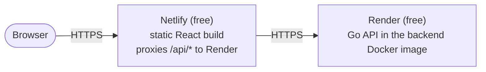

# Deploying the calculator online for free

This guide puts the calculator on the public internet using only free plans. It takes
about 30 minutes the first time and costs nothing as long as you stay inside the limits
listed at the end.

## What you end up with



- **Render** runs the Go API from `backend/Dockerfile` as a free web service. Free
  services sleep after 15 minutes without traffic and take about a minute to wake up; the
  last step keeps it awake with a free ping.
- **Netlify** hosts the built frontend as a static site and proxies every `/api/*`
  request to Render from its own servers. The browser only ever talks to the Netlify
  origin, so CORS stays off and the app behaves exactly as it does locally.
- Both give you HTTPS and a `*.onrender.com` / `*.netlify.app` address for free; a custom
  domain is optional.

Why not one provider: free static hosts cannot run a Go process, and Render's static
sites do not document proxying to another origin. Netlify does, in one line.

## Prerequisites

- A GitHub account (free). Render and Netlify deploy straight from a repository.
- The repository pushed to GitHub. From the project folder:

  ```bash
  git remote add origin https://github.com/uaskh/Calculator.git
  git push -u origin main
  ```

  A public repository also gives you unlimited free GitHub Actions minutes, so the CI
  workflow in `.github/workflows/ci.yml` runs on every push at no cost. (Private
  repositories get 2,000 free minutes a month, which is also plenty.)

`docs/brief.md` is git-ignored and never leaves your machine.

## Step 1: deploy the API on Render

1. Create an account at <https://render.com> (GitHub sign-in; no card needed).
2. **New → Web Service**, connect your GitHub repository.
3. Fill in the form:

   | Field              | Value                                                                                                          |
   | ------------------ | -------------------------------------------------------------------------------------------------------------- |
   | Name               | `calculator-api` (becomes `https://calculator-api.onrender.com`; Render appends a suffix if the name is taken) |
   | Language / Runtime | **Docker**                                                                                                     |
   | Root Directory     | `backend`                                                                                                      |
   | Dockerfile Path    | `backend/Dockerfile`                                                                                           |
   | Instance Type      | **Free**                                                                                                       |
   | Health Check Path  | `/healthz`                                                                                                     |

4. Under **Environment Variables** add:

   | Key                   | Value    | Why                                                                          |
   | --------------------- | -------- | ---------------------------------------------------------------------------- |
   | `HTTP_ADDR`           | `:10000` | Render routes traffic to port 10000 by default                               |
   | `HTTP_SHUTDOWN_DELAY` | `3s`     | keeps serving for 3 s after readiness flips, so a redeploy drops no requests |
   | `LOG_LEVEL`           | `info`   | default; `debug` while troubleshooting                                       |

   Leave `CORS_ALLOWED_ORIGINS` unset: the browser never calls Render directly.

5. Click **Deploy Web Service**. The first build takes two to three minutes (it compiles
   the Go binary inside the multi-stage Dockerfile). When the log shows
   `http server listening`, open `https://<your-service>.onrender.com/healthz` and check
   that it answers `{"status":"ok"}`.
6. Test the API once from your terminal:

   ```bash
   curl -s -X POST https://<your-service>.onrender.com/api/v1/evaluate \
     -H 'Content-Type: application/json' -d '{"expression":"2*(3+4"}'
   ```

   Expected: `{"expression":"2*(3+4)","result":"14"}`.

Every push to `main` redeploys automatically ("Auto-Deploy" is on by default).

## Step 2: add the Netlify configuration to the repository

Netlify reads a `netlify.toml` at the repository root. Create it with the Render address
from step 1 (this is the only place that address appears):

```toml
[build]
  base    = "frontend"
  command = "npm ci && npm run build"
  publish = "dist"

# Same-origin API: Netlify fetches these from Render on the browser's behalf.
[[redirects]]
  from   = "/api/*"
  to     = "https://<your-service>.onrender.com/api/:splat"
  status = 200
  force  = true

# Single-page app: every other path serves the shell.
[[redirects]]
  from   = "/*"
  to     = "/index.html"
  status = 200

# The same security headers nginx sends in the container setup.
[[headers]]
  for = "/*"
  [headers.values]
    X-Content-Type-Options      = "nosniff"
    X-Frame-Options             = "DENY"
    Referrer-Policy             = "no-referrer"
    Permissions-Policy          = "camera=(), microphone=(), geolocation=()"
    Cross-Origin-Opener-Policy  = "same-origin"
    Content-Security-Policy     = "default-src 'self'; img-src 'self' data:; object-src 'none'; base-uri 'self'; form-action 'self'; frame-ancestors 'none'"

[[headers]]
  for = "/assets/*"
  [headers.values]
    Cache-Control = "public, max-age=31536000, immutable"
```

Commit and push it:

```bash
git add netlify.toml
git commit -m "chore(deploy): add Netlify configuration"
git push
```

Notes:

- The `/api/*` rule must come before the `/*` rule; Netlify applies the first match.
- `force = true` makes the proxy win even if a file with that path existed in the build.
- Do not set `VITE_API_BASE_URL`: the default (empty, same origin) is exactly what the
  proxy needs.

## Step 3: deploy the frontend on Netlify

1. Create an account at <https://www.netlify.com> (GitHub sign-in; no card needed).
2. **Add new site → Import an existing project → GitHub**, pick the repository.
3. Netlify reads `netlify.toml`, so the build settings are already filled in
   (base `frontend`, command `npm ci && npm run build`, publish `frontend/dist`). Confirm
   they match and click **Deploy**.
4. Under **Site configuration → Environment variables** add `NODE_VERSION` = `26.8`
   (the value in `.nvmrc`) so the build uses the same Node as the repository.
5. The first build takes one to two minutes. Open the `https://<site>.netlify.app`
   address, type `2+3*4` and check that `14` appears: that request went browser → Netlify
   → Render → back.

Every push to `main` rebuilds the site; pull requests get free preview deploys.

## Step 4: keep the API awake (optional but recommended)

A free Render service sleeps after 15 minutes without requests and needs about a minute
to wake. The calculator's client timeout is 10 seconds, so the first visitor after a quiet
period would see "The calculator service is unavailable. Try again." and have to retry a
minute later. A free uptime pinger avoids that:

1. Create an account at <https://cron-job.org> (free, no card).
2. **Create cronjob**: URL `https://<your-service>.onrender.com/healthz`, schedule
   **every 10 minutes**, request method GET. Save.

Render's free plan includes 750 instance hours per month, and a month has at most 744
hours, so one service that never sleeps still costs nothing. (UptimeRobot's free plan
works the same way if you prefer it.)

## Step 5: verify the deployment

Run the same checks the container smoke test runs, against your public address:

```bash
SITE=https://<site>.netlify.app
curl -sI "$SITE/" | grep -iE 'x-frame-options|content-security-policy'
curl -s -X POST "$SITE/api/v1/evaluate" -H 'Content-Type: application/json' -d '{"expression":"1/0"}'
```

Expected: the two headers, and the 422 problem document
`{"type":"about:blank","title":"Unprocessable Entity","status":422,"detail":"Cannot divide by zero.",…}`.

Then open the site on your phone: the keypad layout appears below 768 px, the desktop
panel above it.

## Updating, logs and rollback

- **Update**: push to `main`. Both services redeploy; Render keeps serving the old
  version until the new container passes `/healthz`.
- **API logs**: Render dashboard → your service → **Logs**. Each request is one JSON line
  with `request_id`, `method`, `path`, `status`, `duration_ms`; the `X-Request-ID`
  response header lets you find the line for a problem a user reports.
- **Build logs**: Netlify → **Deploys** → the deploy. A failed build keeps the previous
  version live.
- **Rollback**: Render → **Events** → "Rollback" on an earlier deploy; Netlify →
  **Deploys** → "Publish deploy" on an earlier one.

## Free-plan limits (as of September 2026; check the providers' pages before relying on them)

| Provider           | Free allowance                                                                                    | What happens beyond it                                              |
| ------------------ | ------------------------------------------------------------------------------------------------- | ------------------------------------------------------------------- |
| Render web service | 750 instance hours/month, 512 MB RAM, sleeps after 15 min idle, one instance                      | Service suspended until the next month unless a card is added       |
| Netlify            | Credit-based free plan (300 credits/month covering bandwidth and build minutes), no card required | Site paused until the next month; nothing is charged without a card |
| cron-job.org       | Unlimited jobs at intervals ≥ 1 minute                                                            | –                                                                   |
| GitHub Actions     | Unlimited minutes on public repositories, 2,000/month on private                                  | Workflow runs queue until the next month                            |

A calculator that a handful of people use stays far inside all of these. Neither Render
nor Netlify charges anything unless you add a payment method, so the worst case is a
paused service, never a bill.

## If you want faster wake-ups later

Google Cloud Run has an always-free tier (2 million requests a month) and starts a Go
container in about a second instead of a minute, but it requires a Google Cloud account
with a payment method on file even while usage stays at $0. The same `backend/Dockerfile`
deploys there unchanged (`gcloud run deploy --source backend --port 8080`, with
`HTTP_ADDR=:8080`); point the Netlify `/api/*` rule at the Cloud Run URL instead.
