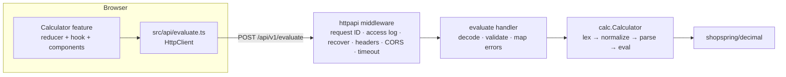

# Calculator: implementation plan

- Spec: `specs/calculator.md` (read on 2026-09-18)
- Mode: greenfield
- Status: approved

## 1. Requirements matrix

Sub-IDs split the spec's requirements into testable criteria. Test names are filled in as
the slices land (Go: `TestX/case`; Vitest: `file › name`; Playwright: `spec › name`).

| ID | Type | Requirement (spec §) | Acceptance criteria | Priority | Tests |
|---|---|---|---|---|---|
| FR-1.1 | Domain | Precedence and left associativity (§4 FR-1, §5) | `2+3*4`→`14`, `(2+3)*4`→`20`, `10-4-3`→`3`, `8/2/2`→`2` | Must | `TestEvaluate/arithmetic` |
| FR-1.2 | Domain | Decimal literals, leading zeros (§4, §5) | `1.5*2`→`3`, `.5+.5`→`1`, `0.1+0.2`→`0.3`, `1.10*3`→`3.3`, `007`→`7`, `00.5`→`0.5` | Must | `TestEvaluate/literals` |
| FR-1.3 | Domain | Division with 40 guard digits, 32 then 16 places (§5) | `1/3`→`0.3333333333333333`, `1/3*3`→`1`, `2/3`→`0.6666666666666667` | Must | `TestEvaluate/division` |
| FR-1.4 | Domain | Whitespace between tokens ignored, trimmed at ends (§5) | `sqrt (16)`→`4`; `1 2`→400 `UNEXPECTED_TOKEN` at 2; `  2 + 2  `→`expression:"2 + 2"` | Must | `TestEvaluate/whitespace`, `TestNormalize` |
| FR-1.5 | API | Canonical result string, `-0`→`0`, matches `^-?(0\|[1-9][0-9]*)(\.[0-9]*[1-9])?$` (§5, §6) | `2^100`→`1267650600228229401496703205376`; `0*-1`→`0`; `-0.0`→`0`; fuzz: every result matches the pattern | Must | `TestEvaluate/canonical`, `FuzzEvaluate` |
| FR-1.6 | Domain | Exact decimal arithmetic, no binary floats (§5, C-1) | `0.1+0.2`→`0.3`; review: no `float64` in `internal/calc` | Must | `TestEvaluate/literals`, review |
| FR-2.1 | Domain | Unary minus (§4) | `-3+5`→`2`, `2*-3`→`-6`, `-(2+3)`→`-5`, `--3`→`3` | Must | `TestEvaluate/unary` |
| FR-2.2 | Domain | Unary plus rejected (§5) | `+3`→400 `UNEXPECTED_TOKEN` at 0 | Must | `TestValidation/unary_plus` |
| FR-3.1 | Domain | `^` right-assoc, above `*`/`/` and unary minus (§4, D10) | `2^10`→`1024`, `2^3^2`→`512`, `-2^2`→`-4`, `(-2)^2`→`4`, `2*2^3`→`16`, `2^-2^2`→`0.0625` | Must | `TestEvaluate/power` |
| FR-3.2 | Domain | Negative integer exponent as `(1/x)^\|n\|` (§5, D27, D30) | `2^-1`→`0.5`, `3^-1`→`0.3333333333333333`, `(-2)^-3`→`-0.125`, `3^-2`→`0.1111111111111111`, `2^-1000`→`0`, `10^-100`→`0` | Must | `TestEvaluate/negative_power` |
| FR-3.3 | Domain | Fractional exponent (§5) | `2^0.5`→`1.414213562373095`; `4^-0.5`→`0.5`; `(-8)^(1/3)`, `(-8)^0.5`→422 `INVALID_POWER`; `(-8)^2.0`→`64` | Must | `TestEvaluate/fractional_power`, `TestArithmeticErrors` |
| FR-3.4 | Domain | Integer powers exact (§5) | `1.1^2`→`1.21`, `2^100`→`1267650600228229401496703205376`, `0^0`→`1`, `0^2`→`0`, `0^0.5`→`0` | Must | `TestEvaluate/power` |
| FR-4.1 | Domain | `sqrt(<expression>)` (§4) | `sqrt(16)`→`4`, `sqrt(2)`→`1.414213562373095`, `sqrt(2)*sqrt(2)`→`2`, `sqrt(0.25)`→`0.5`, `sqrt(0)`→`0` | Must | `TestEvaluate/sqrt` |
| FR-4.2 | Domain | `sqrt` errors (§4, §5) | `sqrt(-1)`→422 `NEGATIVE_SQUARE_ROOT`; `sqrt 16`→400 `UNEXPECTED_TOKEN` at 5; `sqrt()`→at 5; `SQRT(4)`→`UNKNOWN_FUNCTION` at 0 | Must | `TestArithmeticErrors`, `TestValidation` |
| FR-5.1 | Domain | `x%` = x/100 (§5) | `50%`→`0.5`, `10%+5`→`5.1`, `50*10%`→`5`, `50/10%`→`500`, `-50%`→`-0.5`, `2%`→`0.02` | Must | `TestEvaluate/percent` |
| FR-5.2 | Domain | Direct right operand of `+`/`-` → `L*x/100` (§5) | `200+10%`→`220`, `200-10%`→`180`, `200+(10)%`→`220`, `-200+10%`→`-220`, `1+2+10%`→`3.3` | Must | `TestEvaluate/percent` |
| FR-5.3 | Domain | Group, operator or unary minus break directness (§5) | `200+(10%)`→`200.1`, `200+10%*2`→`200.2`, `200+-10%`→`199.9`, `200--10%`→`200.1`, `(200+10)%`→`2.1`, `200+10%^2`→`200.01` | Must | `TestEvaluate/percent` |
| FR-5.4 | Domain | Repeated `%`: outermost node only (§5) | `50%%`→`0.005`, `100+50%%`→`100.5` | Must | `TestEvaluate/percent` |
| FR-5.5 | Domain | `%` binds tighter than `^` (§5) | `2^50%`→`1.414213562373095`, `2%^2`→`0.0004`, `2^2%`→`1.0139594797900291`, `sqrt(16)%`→`0.04` | Must | `TestEvaluate/percent` |
| FR-5.6 | Domain | Percent as zero divisor (§4 FR-8) | `5/0%`→422 `DIVISION_BY_ZERO` | Must | `TestArithmeticErrors` |
| FR-6.1 | Domain | Trailing binary operators dropped repeatedly (§5 rule 2) | `3+4*`→`{expression:"3+4",result:"7"}`, `3+*`→`3`, `2^`→`2`, `2 +`→`expression:"2"` | Must | `TestNormalize` |
| FR-6.2 | Domain | Unmatched `(` closed (§5 rule 3) | `2*(3+4`→`{expression:"2*(3+4)",result:"14"}`; `( 2 + 3`→`expression:"( 2 + 3)"` | Must | `TestNormalize` |
| FR-6.3 | Domain | Trailing `(` / `sqrt (` dropped (§5 rule 2) | `sqrt(`→400 `EMPTY`, `2*(`→`2`, `2+sqrt (`→`2`, `(`→`EMPTY`, `-`→`EMPTY`, `2sqrt(`→`2` | Must | `TestNormalize` |
| FR-6.4 | Domain | Trailing `.` dropped; only one repairable (§5, D-2) | `2.`→`{expression:"2",result:"2"}`, `2+.`→`2`, `.`→`EMPTY`, `2..`/`2.5.`→`INVALID_NUMBER` at 0, `2.+`→`INVALID_NUMBER` at 0 | Must | `TestNormalize`, `TestValidation` |
| FR-6.5 | Domain | Only ends trimmed; nothing else rewritten; `expression` returned on 200 (§5) | `  2 + 2  `→`expression:"2 + 2"`; re-evaluating `expression` yields the same result (fuzz) | Must | `TestNormalize`, `FuzzEvaluate` |
| FR-6.6 | Domain | Order normalization → `EMPTY` → `TOO_DEEP` (§5) | 33 bare `(`→`EMPTY` | Must | `TestValidation/order` |
| FR-7.1 | API | `EMPTY` without `position` (§4, §6) | `""`, `"   "`, `"+"`→400 `VALIDATION_FAILED`, one error `{field:"expression",code:"EMPTY",message:"expression is empty"}`, no `position` key | Must | `TestEvaluateHandler`, `TestValidation` |
| FR-7.2 | API | `UNEXPECTED_TOKEN` positions (§4, §6) | `2 3`→2; `  2 3`→4; `*3`→0; `sqrt`→4 `unexpected end of input`; `sqrt 16`→5; `sqrt()`→5; `2+()`→3 `unexpected ')' at character 4`; `()`→1; `2(3)`→1; `)`→0; `2+)`→2 | Must | `TestValidation` |
| FR-7.3 | API | `UNBALANCED_PARENTHESIS` (§4, §6) | `2+3)`→3, `unbalanced ')' at character 4`; `2)+(3`→1 | Must | `TestValidation` |
| FR-7.4 | API | `INVALID_NUMBER` one token at its start (§4, §5) | `1.2.3`→0, `2.+3`→0, `2+1.2.3`→2, `..`→0; message `invalid number at character 1` | Must | `TestValidation` |
| FR-7.5 | API | `INVALID_CHARACTER` incl. `\n`, `\r`, `×`, `÷`, `−`, code-point positions (§4, §5) | `2$3`→1 `invalid character '$' at character 2`; `2×3`→1; `2\n3`→1; `×2`→0; `1,5`→1 | Must | `TestValidation` |
| FR-7.6 | API | `UNKNOWN_FUNCTION` maximal ASCII-letter runs (§5) | `foo(1)`→0 `unknown function 'foo' at character 1`; `2x`→1; `1e5`→1; `sqrtx(4)`→0 | Must | `TestValidation` |
| FR-7.7 | API | `TOO_LONG` > 1,024 code points before normalization (§5) | 1,025→`TOO_LONG` `expression exceeds 1,024 characters`, no position; 1,024→accepted; spaces count | Must | `TestValidation/limits` |
| FR-7.8 | API | `TOO_DEEP` > 32 nested `(`/`sqrt(` (§5) | 33 pairs→`TOO_DEEP` `expression is nested deeper than 32 levels`, no position; 32→200; 33 nested `sqrt(`→`TOO_DEEP`; 32 `(`+`1` unclosed→200 | Must | `TestValidation/limits` |
| FR-7.9 | API | Validation problem shape (§4, §6) | `code:"VALIDATION_FAILED"`, `status:400`, exactly one `errors[]` entry, `detail == errors[0].message`, `application/problem+json` | Must | `TestEvaluateHandler`, e2e |
| FR-7.10 | Domain | Validation order (§5) | 1,025 chars containing `$`→`TOO_LONG`; `2+$`→`INVALID_CHARACTER` at 2; `$`→`INVALID_CHARACTER`; 33 pairs + extra `)`→`TOO_DEEP` | Must | `TestValidation/order` |
| FR-7.11 | API | `null`/missing → `REQUIRED`; non-string → `MALFORMED_REQUEST` (§6) | `{}`, `{"expression":null}`→400 `VALIDATION_FAILED` `REQUIRED` `expression is required`; `{"expression":2}`→400 `MALFORMED_REQUEST` | Must | `TestEvaluateHandler` |
| FR-8.1 | Domain | `DIVISION_BY_ZERO` incl. `0^negative` (§4, §5) | `1/0`, `0/0`, `5/0%`, `0^-1`, `10^99/10^-99`→422 | Must | `TestArithmeticErrors` |
| FR-8.2 | Domain | `NEGATIVE_SQUARE_ROOT` | `sqrt(-4)`→422 | Must | `TestArithmeticErrors` |
| FR-8.3 | Domain | `INVALID_POWER`, exponents are evaluated values (§5) | `(-8)^0.5`, `(-2)^(1/3*3)`, `(-1)^0.5`→422; README documents `(-2)^(1/3*3)` | Must | `TestArithmeticErrors`, README |
| FR-8.4 | Domain | `RESULT_TOO_LARGE` for literal, intermediate, final ≥ 10^100; pre-check `(d-1)·floor(\|n\|) ≥ 100` (§5) | 422: `10^100`, `10^99*10`, `2^1000`, `10^100/10^100`, `1`+100 zeros, `(1.1^1000)^1000`, `99^999.5`, `9^999.5`, `0.5^-1000`, `2^333`. 200: `10^99`, `2^300`, `2^332`, `1.0001^1000`, `0`+100 zeros→`0` | Must | `TestArithmeticErrors`, `TestEvaluate/limits` |
| FR-8.5 | Domain | `EXPONENT_TOO_LARGE` for `\|n\| > 1000` before computing (§5) | `1.0001^1001`, `2^-1001`, `(-8)^1001.5`→422; `2^1000`→`RESULT_TOO_LARGE` | Must | `TestArithmeticErrors` |
| FR-8.6 | Domain | `^` check order (§5, D26) | `(-8)^1001.5`→`EXPONENT_TOO_LARGE`; `0^-1001`→`EXPONENT_TOO_LARGE`; `0^-1`→`DIVISION_BY_ZERO`; `(-8)^-0.5`→`INVALID_POWER` | Must | `TestArithmeticErrors/order` |
| FR-8.7 | Domain | Rounding: literals and intermediates 32 places, final 16, half away from zero (§5, D12/15/29) | `0.1^20`→`0`; `0.5^1000`→`0`; `(0.5^1000)^1000`→`0`; `1/10^33*10^33`→`0`; `0.`+32 zeros+`5`→`0`; `-0.00000000000000005`→`-0.0000000000000001`; `-0.00000000000000004`→`0`; `2^-0.5`→`0.7071067811865475` | Must | `TestEvaluate/rounding` |
| FR-8.8 | API | 422 shape (§6) | `1/0`→422 `code:"DIVISION_BY_ZERO"`, `detail:"Cannot divide by zero."`, no `errors` | Must | `TestEvaluateHandler` |
| FR-9.1 | UI | One labelled single-line input; `maxLength=1024`, `autoComplete=off`, `spellCheck=false` (§4, §7) | `getByLabelText('Expression')` is the only textbox with those attributes | Must | `Calculator.test.tsx › input` |
| FR-9.2 | UI | Exactly one request 150 ms after the last change (§4) | Type `2+2`, wait → one POST, `<output>` shows `4`; `*3` within 150 ms → no request for `2+2` | Must | `Calculator.test.tsx › debounce`, `useCalculator.test.ts` |
| FR-9.3 | UI | In-flight request aborted on change; stale response never shown (§4, D22) | Slow handler, edit during flight → signal aborted, old result never rendered | Must | `useCalculator.test.ts › abort` |
| FR-9.4 | UI | Empty input or 400 `EMPTY` → blank result, no message (§4, D18) | `(`, `-`, `sqrt(` → empty output, no status, no alert, no `aria-invalid` | Must | `Calculator.test.tsx › empty` |
| FR-9.5 | UI | No live request after a commit until the input changes (§4, D21) | After `=`, no POST until an edit | Must | `Calculator.test.tsx › committed` |
| FR-9.6 | UI | Previous result stays; "Calculating…" only after 300 ms without response (§4, §7) | Response at 200 ms → never replaced; at 400 ms → `Calculating…` from 300 ms until it arrives | Must | `useCalculator.test.ts › slow` |
| FR-9.7 | UI | "Evaluated as …" only on 200 with differing `expression`; hidden on error and after commit (§4, §7) | `2*(3+4`→`Evaluated as 2*(3+4)`; `  2+2 `→hidden; after error or `=`→hidden | Must | `Calculator.test.tsx › evaluated as` |
| FR-10.1 | UI | Keypad layout, labels, `=` is `type=submit` spanning two columns (§7) | 22 buttons in spec order; aria-labels: clear, backspace, open parenthesis, close parenthesis, divide, multiply, subtract, add, decimal point, percent, square root, power, equals | Must | `Keypad.test.tsx › layout` |
| FR-10.2 | UI | Taps append ASCII tokens; `sqrt` inserts `sqrt(` (§4) | `7 × ( 2 + 1 )`→`7*(2+1)`, live `21`; `sqrt 1 6 )`→`sqrt(16)`, `4` | Must | `Calculator.test.tsx › keypad` |
| FR-10.3 | UI | Keys append at the end, caret at end, focus stays on input (§7) | Caret at 0 in `12`, tap `3`→`123`, caret 3, input focused | Must | `Calculator.test.tsx › keypad focus` |
| FR-10.4 | UI | Insert exceeding 1,024 characters ignored (§7) | 1,020 chars + `sqrt`→unchanged; 1,023 + `1`→1,024; then `1`→unchanged | Must | `model.test.ts › insertKey` |
| FR-10.5 | UI | Every key ≥ 44×44 px, Tab reaches each (§4, NFR-1) | Playwright bounding boxes on both projects; Tab order | Must | `e2e/accessibility.spec.ts` |
| FR-11.1 | UI | `=`/Enter commits; result replaces the expression (§4) | `2+2` Enter → input `4`, history `2+2 = 4`; `*3` Enter → `12`; `=` click identical | Must | `Calculator.test.tsx › commit`, `e2e/calculator.spec.ts` |
| FR-11.2 | UI | Commit error → alert, input kept (§4) | `1/0` `=` → alert `Cannot divide by zero.`, input `1/0` | Must | `Calculator.test.tsx › commit error` |
| FR-11.3 | UI | Normalized expression and result added to history (§4, D20) | `2*(3+4` `=` → input `14`, history `2*(3+4) = 14` | Must | `Calculator.test.tsx › commit` |
| FR-11.4 | UI | During commit `=` disabled, Enter ignored; commit cancels debounce, aborts live, sends its own (§4, D23) | Pending debounce + `=` → one POST; live aborted; second Enter sends nothing; `=` disabled | Must | `useCalculator.test.ts › commit`, `Calculator.test.tsx` |
| FR-11.5 | UI | Enter on empty/whitespace does nothing (§4) | No request, no history | Must | `Calculator.test.tsx › empty commit` |
| FR-11.6 | UI | Commit answered `EMPTY` → input kept, blank result, no history (§4) | `(` `=` → input `(`, blank, no alert, history unchanged | Must | `Calculator.test.tsx › empty commit` |
| FR-11.7 | UI | After commit result area blank until edit (§4, §7) | `<output>` empty; "Evaluated as" hidden | Must | `Calculator.test.tsx › commit` |
| FR-11.8 | UI | Negative result re-entered as `(-5)`; history stores raw result (§4, D13) | `2-7` `=` → input `(-5)`, history `2-7 = -5`; `^2` Enter → `25` | Must | `model.test.ts › wrapResult`, `Calculator.test.tsx` |
| FR-11.9 | UI | Every commit appends, duplicates included (§4, D31) | `4` `=` → `4 = 4`; `2+2` twice → two entries | Must | `model.test.ts › history` |
| FR-11.10 | UI | Focus stays on input after `=` (§4, §7) | `document.activeElement` is the input | Must | `Calculator.test.tsx › focus` |
| FR-12.1 | UI | `⌫` removes the last character (§4, D19) | `12+3`→`12+`; `sqrt(`→`sqrt`; empty → no-op | Must | `model.test.ts › backspace` |
| FR-12.2 | UI | `C`/Escape clear input, result, error; abort in-flight; keep focus; history unchanged (§4) | With alert and pending request: Escape → all cleared, aborted, focused, history intact; `C` identical | Must | `Calculator.test.tsx › clear` |
| FR-13.1 | UI | Network/5xx: alert on commit, status text while typing; input preserved (§4) | MSW error/500/503 → commit alert `The calculator service is unavailable. Try again.`; typing → same text as status, no alert | Must | `Calculator.test.tsx › network` |
| FR-13.2 | UI | 400 `VALIDATION_FAILED` → first `errors[].message` verbatim (§4) | `2+3)` → `unbalanced ')' at character 4` | Must | `model.test.ts › messageFor`, `Calculator.test.tsx` |
| FR-13.3 | UI | `MALFORMED_REQUEST`, other statuses, unknown codes → `Something went wrong. Try again.` (§4, §7) | MSW 413 (HTML), 415, 404, 422 `NEW_CODE`, 400 `MALFORMED_REQUEST` | Must | `model.test.ts › messageFor` |
| FR-13.4 | UI | No response within 10 s → network message (§4, §7) | Fake timers 10 s → `The calculator service is unavailable. Try again.` | Must | `useCalculator.test.ts › timeout` |
| FR-13.5 | UI | `aria-invalid` + `aria-describedby` only for committed 400/422; never for network (§4, D-3) | Commit `1/0` → `aria-invalid="true"`, described by the alert; network → none; typing errors → none | Must | `Calculator.test.tsx › a11y` |
| FR-13.6 | UI | Any edit clears the alert (§4) | One character after an alert → alert and `aria-invalid` gone | Must | `Calculator.test.tsx › edit clears` |
| FR-13.7 | UI | Arithmetic wording (§7) | Five codes → five sentences | Must | `model.test.ts › messageFor` |
| FR-14.1 | UI | History list, heading "History", newest first, hidden when empty (§4, §7) | No list before first commit; after `2+2`, `3*3` → `3*3 = 9` above `2+2 = 4` | Should | `History.test.tsx`, `Calculator.test.tsx` |
| FR-14.2 | UI | Activating an entry loads it, caret at end, focus, live result via debounce (§4) | Click → input `2+2`, `selectionStart 3`, focused, one POST after 150 ms, `4` | Should | `Calculator.test.tsx › history` |
| FR-14.3 | UI | 21st commit drops the oldest (§4, D8) | 21 commits → 20 entries | Should | `model.test.ts › history` |
| FR-14.4 | UI | Reload empties history (§4) | Playwright reload → no list | Should | `e2e/calculator.spec.ts` |
| FR-14.5 | UI | Entries show full text (§7) | 100-digit result complete in entry | Should | `History.test.tsx` |
| FR-15.1 | API | `GET /healthz` → 200 `{"status":"ok"}` (§4, §6) | Body, `Cache-Control: no-store`, `X-Request-ID` | Must | `TestHealth`, e2e |
| FR-15.2 | API | `GET /readyz` 200 / 503 `NOT_READY` during shutdown (§4) | Flag unset → 200 `{"status":"ok"}`; set → 503 `NOT_READY` | Must | `TestReadiness` |
| FR-15.3 | Backend | Flag flips on SIGTERM/SIGINT before the server stops (§4) | Cancel ctx → `BeginShutdown` called before `srv.Shutdown`; in-flight request completes | Must | `TestServe_Shutdown`, `TestApp_Readiness` |
| API-1 | API | Single `POST /api/v1/evaluate`; 404/405 problems (§6, D3) | 200 example; `GET`→405 with `Allow`; `/api/v1/nope`→404 | Must | `TestEvaluateHandler`, e2e |
| API-2 | API | `X-Request-ID` and `Cache-Control: no-store` on every response (§6) | Asserted on 200, 400, 404, 405, 413, 415, 422, 500, 503 | Must | `TestMiddleware`, e2e |
| API-3 | API | Request ID: 32 hex from `crypto/rand`; echo `^[A-Za-z0-9._-]{1,64}$` (§6) | None→`^[0-9a-f]{32}$`; `abc.DEF_1-2`→echoed; 65 chars, space, `é`→replaced | Must | `TestRequestID` |
| API-4 | API | `mime.ParseMediaType`; exactly `application/json` (§6) | `application/json; charset=utf-8` ok; `text/plain`, missing, `application/problem+json`→415 | Must | `TestDecodeJSON` |
| API-5 | API | `MALFORMED_REQUEST` cases (§6) | `{bad`, `{"expression":2}`, unknown field, two objects, empty, `[]`, `null`→400 | Must | `TestDecodeJSON`, `TestEvaluateHandler` |
| API-6 | API | 413 above 4 KiB (§5, §6) | 4,096 bytes ok; 4,097→413 `PAYLOAD_TOO_LARGE`; README documents 413-before-`TOO_LONG` | Must | `TestEvaluateHandler/body_limit` |
| API-7 | API | 503 `TIMEOUT` after 5 s (§5, §6, D33) | Fake evaluator blocking on ctx + short timeout → 503 `TIMEOUT` with all headers | Must | `TestEvaluateHandler/timeout` |
| API-8 | API | 500 `INTERNAL_ERROR`, details logged with request ID, no leak (§6, NFR-6) | Panic → 500 problem; log has `request_id`, `error`; body has no stack | Must | `TestRecoverer` |
| API-9 | API | Security headers on every response; nginx adds shell CSP (§6) | Five headers on 200/4xx/5xx; nginx config reviewed; compose smoke shows six on `/` | Must | `TestSecurityHeaders`, Phase 6 smoke |
| API-10 | API | CORS off by default; `*` rejected; echo + `Vary`; preflight headers (§6) | `Load` with `*`→error; allowed origin echoed with `Vary: Origin`; other origin nothing; preflight `GET, POST` / `Content-Type, X-Request-ID` / `600` | Must | `TestConfig`, `TestCORS` |
| API-11 | Docs | OpenAPI 3.1 contract incl. result pattern (§6) | Schemas, examples, every problem response, `code` enums | Must | review, README |
| UI-1 | UI | Title "Calculator", document title (§7) | h1 and `document.title` | Must | `App.test.tsx` |
| UI-2 | UI | `inputMode` none on coarse pointer, text otherwise (§7, D25) | `matchMedia` mocked; Pixel 7 project → `none`; desktop → `text` | Must | `Calculator.test.tsx`, e2e |
| UI-3 | UI | `<output aria-live=polite>`; monospace, single-line, horizontal scroll; 118 chars intact (§7) | `<output>` present; long result fully in DOM; no page overflow | Must | `Calculator.test.tsx`, `e2e/responsive.spec.ts` |
| UI-4 | UI | Only Enter/Escape shortcuts; native Backspace (§7) | Backspace mid-text deletes before caret only | Must | `Calculator.test.tsx › keyboard` |
| UI-5 | UI | Errors never move focus (§7) | Focus stays on input after a commit error | Must | `Calculator.test.tsx › focus` |
| UI-6 | UI | Theme via `prefers-color-scheme`; contrast ≥ 4.5:1 by unit test and axe; reduced motion (§7) | `contrast.test.ts` over `tokens.css` pairs; axe in light and dark | Must | `contrast.test.ts`, `e2e/accessibility.spec.ts` |
| NFR-1 | A11y | WCAG 2.2 AA; 44 px targets; zero axe violations on both projects (§8) | axe in idle, result, error, history states | Must | `e2e/accessibility.spec.ts` |
| NFR-2 | Responsive | No page-level horizontal scroll at 320, 412, 1280 px (§8) | `scrollWidth <= innerWidth` with a 118-char result and 1,024-char input | Must | `e2e/responsive.spec.ts` |
| NFR-3 | Quality | Layers, fuzz, coverage 80/90, `docs/coverage.md` (§8) | `make coverage` passes | Must | `make coverage` |
| NFR-4 | Perf | Single-pass parser; benchmark corpus < 5 ms each; numbers in `docs/coverage.md` (§8) | `BenchmarkEvaluate/<case>` | Must | `bench_test.go`, review |
| NFR-5 | Security | Server-side validation, limits, headers, same-origin `/api` (§8) | API-9/10; Vite and nginx proxies | Must | as above |
| NFR-6 | Observability | slog fields per request; `error` on 5xx/panics; post-header panics logged (§8) | Buffer logger asserts every key | Must | `TestAccessLog`, `TestRecoverer` |
| NFR-7 | Operability | Env defaults (§8, D-5) | `TestConfig` per default and invalid value | Must | `TestConfig` |
| NFR-8 | Maintainability | Operator and function tables; no operator `switch` outside the domain (§8) | Table-driven parser/evaluator; review | Must | `TestOperatorTable`, review |
| DEL-1..6 | Delivery | Makefile, dev.sh, README with executed examples, OpenAPI, coverage report, seven ADRs, `docs/prompts.md`, `docs/brief.md` ignored + CI check, Dockerfiles, `compose.yaml`, CI (§10) | Phase 7/8 checklist | Must | `make verify`, CI |

## 2. Decisions and assumptions

| ID | Question | Decision (who, when) | Consequence |
|---|---|---|---|
| D-1 | Git identity and dependency guardrail | User set `user.name`/`user.email` globally and `GO_DEPENDENCY_POLICY="no-frameworks"` by hand; Claude amended `CLAUDE.md`, `rules/backend-go.md`, `definition-of-done.md` (user, 2026-09-18) | `github.com/shopspring/decimal` v1.4.0 is the single module dependency; depguard allow-list amended at scaffold time |
| D-2 | Dangling `.` before droppable tokens (`2.+`) | `INVALID_NUMBER` at the number's position; a number ending in `.` is valid only as the last token of the trimmed input (user, 2026-09-18) | Single detection point in the lexer; `2.`→`2`, `2.+`→400 |
| D-3 | `aria-invalid` while typing | Only after a commit, linked to the alert; live errors are polite status text only (user, 2026-09-18) | Reducer marks `invalid` only on commit failures with status 400/422 |
| D-4 | Edits during an in-flight commit | Any edit aborts the commit, re-enables `=`, and follows the debounced path (user, 2026-09-18) | One abort path for live and commit requests |
| D-5 | Body limit and handler timeout | Environment variables `HTTP_MAX_BODY_BYTES=4096`, `HTTP_REQUEST_TIMEOUT=5s`, documented in the README config table (user, 2026-09-18) | Config tests cover both; README lists them with the other limits |
| D-6 | Docker | User installs Docker before Phase 6; compose smoke test runs locally then (user, 2026-09-18) | Phase 6 blocks on `docker compose` availability |
| D-7 | `docs/prompts.md` | The `/spec` prompt is pasted by the user in Phase 7; `/implement` invocation recorded now (user, 2026-09-18) | Phase 7 asks for the text |
| D-8 | Branch | `master` renamed to `main`; CI triggers on `main` and pull requests (user, 2026-09-18) | Matches the template workflow |

| ID | Assumption | Why it is safe to assume |
|---|---|---|
| A-1 | Layout: `backend/internal/calc/` (`token.go`, `lexer.go`, `normalize.go`, `parser.go`, `ast.go`, `number.go`, `operators.go`, `functions.go`, `eval.go`, `errors.go`, `calc.go`), `backend/internal/httpapi/evaluate.go`; frontend `src/api/evaluate.ts`, `src/features/calculator/` (`model.ts`, `useCalculator.ts`, `Calculator.tsx`, `Keypad.tsx`, `History.tsx`), `src/lib/contrast.ts` | Names within the reference layout are ours |
| A-2 | Domain errors: `*calc.ValidationError{Code, Position *int, Message}` for 400s (message rendered from the §6 templates in the domain, HTTP-free) and `*calc.ArithmeticError{Code}` for 422s; `httpapi` maps them in one function | Standard error-contract shape |
| A-3 | `UNEXPECTED_TOKEN` messages quote the token's source text: `1 2`→`unexpected '2' at character 3`; `sqrt 16`→`unexpected '16' at character 6` | The only template given quotes the token verbatim |
| A-4 | `)` where an operand is expected with no open group (`)`, `2+)`) is `UNEXPECTED_TOKEN` at the `)`; `UNBALANCED_PARENTHESIS` is reported when a complete expression is followed by `)` with no open group | Parser-driven reading satisfies both spec examples (`()`, `2+3)`) |
| A-5 | Operator table entries: symbol, kind (binary/postfix), precedence, associativity, evaluate function, `percentRelativeRight` flag; `+`/`-` set the flag, the `%` entry's evaluate takes an optional base. Unary minus is grammar with a fixed precedence between `*` and `^` | Satisfies NFR-8 while keeping the rule where the spec puts it |
| A-6 | `INVALID_CHARACTER` shows printable characters verbatim and Go-quotes control characters (`invalid character '\n' at character 2`) | Message readability only; code and position are the contract |
| A-7 | End-of-input `position` = code-point length of the original untrimmed input | Literal §6; the UI never uses `position` |
| A-8 | 400 `EMPTY` never sets `aria-invalid`/`aria-describedby` | Nothing is displayed; consistent with FR-9.4 |
| A-9 | History activation is treated as an edit even when the text is unchanged (clears alerts, restarts the debounce) | Needed for FR-14.2 in the `4 = 4` case |
| A-10 | Empty or whitespace-only input sends no live request; history entries longer than 1,024 characters (auto-closed parentheses) load and yield the backend's `TOO_LONG` status text | Same observable result; fewer requests |
| A-11 | Media type check is exactly `application/json` (template's `+json` suffix acceptance removed) | Literal spec |
| A-12 | `MALFORMED_REQUEST` keeps the template's `errors[]` (`INVALID_TYPE`, `UNKNOWN_FIELD`) and is documented in OpenAPI; Go's case-insensitive field matching and last-duplicate-wins are documented | Additive; stdlib behaviour |
| A-13 | The evaluator takes `context.Context` and checks `ctx.Err()` per node and per multiplication step; the handler maps `context.DeadlineExceeded` to 503 `TIMEOUT` | Makes the 5 s timeout real without leaking goroutines |
| A-14 | Fractional exponent `n`: `x^floor(n)` through the capped square-and-multiply, `x^(n−floor(n))` through `PowWithPrecision(…, 72)`, product rounded to 32 places. Negative exponents (any) first take the reciprocal via the division path | Keeps `9^999.5` within NFR-4; "the library's power with precision" still does the fractional part |
| A-15 | Division: `QuoRem` truncated at 72 places then rounded to 32; `sqrt`: integer square root of the scaled coefficient (`big.Int.Sqrt`, Newton) truncated at 72 places then rounded to 32 | Truncation plus rounding yields the correctly rounded 32-place value |
| A-16 | Benchmark corpus: 1,024-digit literal, `0.`+1,022 digits, `1.0001^1000`, `(1.0001^1000)^1000`, 32-deep `2^0.5` chain, 32-deep `sqrt` chain, 32-deep parentheses, `2^332`, `99^50`, `9^999.5` | "Named worst-case corpus" leaves the names to us |
| A-17 | CI keeps the template's four jobs (they mirror `make verify`), adds the `docs/brief.md` tracked-file check and Go module caching; action versions checkout v7, setup-go v7, setup-node v7, golangci-lint-action v9 (`v2.13`), upload-artifact v7 | Delivery rule: "mirrors `make verify`" |
| A-18 | `LOG_FORMAT=text` set by the Makefile `run-backend` target that `scripts/dev.sh` calls | Equivalent to "dev.sh sets text" |
| A-19 | Frontend keeps `VITE_API_TIMEOUT_MS` (default 10000); `VITE_API_BASE_URL` defaults to `''` and the client appends `/api/v1` | 10 s is the spec value; override is additive |
| A-20 | `ApiError.kind === 'invalid-response'` maps to `Something went wrong. Try again.`; `'aborted'` is swallowed | Same class as "unexpected status" |
| A-21 | After a failed commit the result area is blank (the alert is the only message) | Consistent with FR-11.7 and "replaces the result" |
| A-22 | Keypad buttons prevent focus loss with `onMouseDown` `preventDefault` plus explicit `input.focus()` after `=`, `C` and history activation | Implementation detail behind FR-10.3/FR-11.10 |
| A-23 | API responses also carry the template's `Content-Security-Policy: default-src 'none'; frame-ancestors 'none'` and `Access-Control-Expose-Headers: X-Request-ID` when CORS applies; nginx hides the API CSP and serves the shell's `default-src 'self'` | Additive defence; the spec lists required headers, not a maximum |
| A-24 | `docs/coverage.md` gets a "Benchmarks" section with `BenchmarkEvaluate` numbers from `make coverage` (local) and the CI summary | NFR-4 gives no format |
| A-25 | Playwright covers 320 px with `page.setViewportSize` inside the desktop project; projects keep the template names with the spec's devices | No third project required |
| A-26 | Access log `duration_ms` is an integer millisecond count; `error` holds the problem code and detail for 5xx and the panic value for panics | NFR-6 names the keys, not the formats |
| A-28 | ESLint is pinned to major 9 (`eslint@^9`, `@eslint/js@^9`) because `eslint-plugin-jsx-a11y` 6.10 declares ESLint 3–9 support only; every other plugin supports 9 | Cleanest resolution of a peer conflict the template created; dev tooling only |
| A-27 | Ports: API 8080, Vite 5173, containers web 3000; Playwright uses 18080/14173 | Clarification guide defaults |

## 3. Architecture



**Backend packages**

| Package | Responsibility | Imports |
|---|---|---|
| `cmd/api` | flags, signals, exit codes | app, config, server |
| `internal/app` | `New(cfg, logger) *App` (`Handler`, `BeginShutdown()`); wires `calc.New()` into `httpapi.Deps` | everything below |
| `internal/config` | env → `Config`; defaults per NFR-7 and D-5; rejects `CORS_ALLOWED_ORIGINS=*` | stdlib |
| `internal/server` | `Run`/`Serve` with timeouts; calls `beforeShutdown` before `srv.Shutdown` | config |
| `internal/httpapi` | router, `evaluate.go` (handler, DTOs, error mapping), middleware, problems, decode | calc |
| `internal/calc` | pure domain: `Calculator.Evaluate(ctx, input) (Result, error)` | stdlib + decimal |

**Domain pipeline** (`internal/calc`): `Evaluate` runs `checkLength` → `lex` (tokens carry
code-point positions into the original input; identifiers checked against the function
table) → `normalize` (trim, drop trailing droppables, close parentheses, produce the
normalized string) → `EMPTY` → `checkDepth` → `parse` (precedence climbing driven by the
operator table; unary minus at fixed precedence; postfix `%` loop after primaries; Group and
Call nodes) → `eval` (walk with `ctx`, 32-place rounding after every operation, magnitude
cap) → final 16-place rounding → canonical string.

**Extension points**: a binary or postfix operator is one entry in `operators.go`; a
function is one entry in `functions.go`. Parser, evaluator, handler and DTOs stay untouched.

**Frontend**: `src/api/evaluate.ts` (types, parser, endpoint) → `features/calculator/model.ts`
(pure reducer: expression, phase, result, evaluatedAs, message, invalid, history; helpers
`insertKey`, `backspace`, `wrapResult`, `messageFor`, `historyText`) → `useCalculator.ts`
(debounce 150 ms, `AbortController`, 300 ms slow timer, request sequencing, commit) →
`Calculator.tsx` (form, labelled input, `<output>`, message region), `Keypad.tsx`,
`History.tsx` → composed in `app/App.tsx`.

## 4. API contract

| Method | Path | Request | Success | Errors (status/code) |
|---|---|---|---|---|
| POST | `/api/v1/evaluate` | `{ "expression": string }` (required, non-null, ≤ 4 KiB body) | 200 `{ "expression": string, "result": string }` | 400 `MALFORMED_REQUEST`, 400 `VALIDATION_FAILED` (`errors[0].code` ∈ REQUIRED, EMPTY, TOO_LONG, TOO_DEEP, INVALID_CHARACTER, INVALID_NUMBER, UNEXPECTED_TOKEN, UNBALANCED_PARENTHESIS, UNKNOWN_FUNCTION; optional `position`), 413 `PAYLOAD_TOO_LARGE`, 415 `UNSUPPORTED_MEDIA_TYPE`, 422 DIVISION_BY_ZERO / NEGATIVE_SQUARE_ROOT / INVALID_POWER / EXPONENT_TOO_LARGE / RESULT_TOO_LARGE, 503 `TIMEOUT`, 500 `INTERNAL_ERROR` |
| GET | `/healthz` | – | 200 `{ "status": "ok" }` | – |
| GET | `/readyz` | – | 200 `{ "status": "ok" }` | 503 `NOT_READY` |
| any | unknown | – | – | 404 `NOT_FOUND`, 405 `METHOD_NOT_ALLOWED` (+ `Allow`) |

`result` matches `^-?(0|[1-9][0-9]*)(\.[0-9]*[1-9])?$`, at most 118 characters. Validation
messages follow the §6 templates; 422 `detail` is the §7 sentence. Every response carries
`X-Request-ID`, `Cache-Control: no-store` and the five security headers. Examples:

```
POST /api/v1/evaluate {"expression":"2*(3+4"}   → 200 {"expression":"2*(3+4)","result":"14"}
POST /api/v1/evaluate {"expression":"2+()"}     → 400 {…,"code":"VALIDATION_FAILED","detail":"unexpected ')' at character 4","errors":[{"field":"expression","code":"UNEXPECTED_TOKEN","position":3,"message":"unexpected ')' at character 4"}]}
POST /api/v1/evaluate {"expression":"1/0"}      → 422 {…,"code":"DIVISION_BY_ZERO","detail":"Cannot divide by zero."}
```

## 5. UI design

Single screen. Regions: header (`h1` "Calculator"), display (label "Expression" + input,
`<output aria-live="polite">` for the result, muted "Evaluated as …" line), message region
(`role="status"` while typing; `role="alert"` after a commit, linked with
`aria-describedby`, input `aria-invalid`), keypad (4-column grid in the spec order, `=`
spans two columns, `type="submit"`), history (`h2` "History", `<ul>` of buttons, hidden when
empty).

States: empty → typing (debounce; old result visible; "Calculating…" after 300 ms) →
success / error(status) → committing (`=` disabled; Enter ignored; edits abort per D-4) →
committed (input = result or `(-n)`; output blank; no request until edit) / commit error
(alert; input kept; output blank). Escape/`C` reset to empty (history kept).

Copy: the five arithmetic sentences, the network sentence, the generic sentence, and
server validation messages verbatim (§7). Keyboard: Enter commits, Escape clears, everything
else native. Responsive: mobile-first, keys ≥ 44 px, input and output scroll horizontally,
history entries wrap. Theme: light/dark tokens with ≥ 4.5:1 text contrast, transitions
disabled under `prefers-reduced-motion`.

## 6. Configuration

| Variable | Component | Default | Purpose |
|---|---|---|---|
| `HTTP_ADDR` | backend | `:8080` | listen address |
| `HTTP_READ_HEADER_TIMEOUT` / `HTTP_READ_TIMEOUT` / `HTTP_WRITE_TIMEOUT` / `HTTP_IDLE_TIMEOUT` | backend | `5s` / `10s` / `15s` / `60s` | server timeouts |
| `HTTP_SHUTDOWN_TIMEOUT` | backend | `10s` | grace period |
| `HTTP_REQUEST_TIMEOUT` | backend | `5s` | handler deadline → 503 `TIMEOUT` (D-5) |
| `HTTP_MAX_BODY_BYTES` | backend | `4096` | request body limit → 413 (D-5) |
| `LOG_LEVEL` / `LOG_FORMAT` | backend | `info` / `json` (`text` under `make dev`) | logging |
| `CORS_ALLOWED_ORIGINS` | backend | empty | exact origins; `*` rejected |
| `VITE_API_BASE_URL` | frontend | empty | origin of the API; `/api/v1` appended |
| `VITE_API_TIMEOUT_MS` | frontend | `10000` | client fetch timeout |
| `API_PROXY_TARGET` | Vite dev server | `http://localhost:8080` | `/api` proxy target |

Domain constants (README "Limits"): expression ≤ 1,024 code points, depth ≤ 32, `|exponent| ≤ 1000`, `|value| < 10^100`, 32 intermediate places, 16 result places.

## 7. Test strategy

- **Go domain** (`internal/calc`, ≥ 90%): table tests per sub-requirement listing every spec example; `TestValidation` for codes, positions and messages; `TestArithmeticErrors` incl. check order; `TestOperatorTable` proving a registered operator is parsed and evaluated; `FuzzEvaluate` (no panic, pattern on success, idempotent normalization, ctx honoured); `BenchmarkEvaluate` over A-16.
- **Handler** (`internal/httpapi`): decoding, validation, error mapping, headers, request ID rules, CORS, access-log fields, panic recovery, timeout → 503.
- **Config/server/app**: defaults, invalid values, `*` rejection, shutdown ordering, readiness flag.
- **Black-box API** (`test/e2e`): contract examples over real HTTP against `app.New`.
- **Frontend unit**: reducer and helpers (`model.test.ts`), API parser (`evaluate.test.ts`), contrast over tokens.
- **Component** (MSW): input, debounce, abort, slow response, commit paths, errors, keypad, history, a11y roles.
- **Playwright** (desktop + Pixel 7): happy path, normalization display, validation and arithmetic errors, network/5xx via `page.route`, keyboard-only, keypad on mobile, history reload, axe (light/dark), tap sizes, 320/412/1280 overflow.

## 8. Tasks

### Phase 3: Scaffold
- [x] T-1 Repo files (`scaffold.sh repo`), CI action versions, `compose.yaml` rename (`web`/`backend`), `.gitignore` `docs/brief.md`, ADR 0001 wording for the decimal module
- [x] T-2 Backend skeleton (`scaffold.sh backend`), `go get github.com/shopspring/decimal@v1.4.0`, depguard allow-list, config defaults (D-5, 10 s shutdown), readiness body `ok`
- [x] T-3 Frontend skeleton (Vite + overlay + dev deps incl. `@axe-core/playwright`), tsconfig/ESLint merge (`VITE_API_BASE_URL` semantics move to T-11)
- [x] T-4 `make fmt lint typecheck test build` green; `make dev` smoke via Vite proxy; commit `chore: scaffold backend and frontend`

### Phase 4: Backend
- [ ] T-5 (FR-1.4, FR-6, FR-7) Tokens, lexer, normalizer, validation errors and messages, depth check
- [ ] T-6 (FR-1..5, NFR-8) AST, operator/function tables, table-driven parser
- [ ] T-7 (FR-1..5, FR-8) Number helpers (rounding, cap, division, sqrt, power), evaluator with ctx, canonical output, fuzz, benchmark
- [ ] T-8 (API-1..8, FR-7.9, FR-7.11, FR-8.8) `evaluate` handler, DTOs, error mapping, timeout → 503, OpenAPI
- [ ] T-9 (API-3, API-9, API-10, NFR-6, FR-15) Middleware deltas: request-ID rule, security headers, CORS rules, access-log fields, `*` rejection; readiness flag and shutdown ordering
- [ ] T-10 Wiring in `app`, black-box tests for the contract examples; `go vet`, lint, `-race`, coverage; commit `feat(api): …`

### Phase 5: Frontend
- [ ] T-11 (FR-9, FR-13) `src/api/evaluate.ts` + MSW handler; `config.ts` base URL
- [ ] T-12 (FR-10.4, FR-11.8/9, FR-12.1, FR-13.2/3/7, FR-14.3) `model.ts` reducer and helpers
- [ ] T-13 (FR-9.2/3/5/6, FR-11.4, FR-13.4, D-4) `useCalculator.ts`
- [ ] T-14 (FR-9.1/4/7, FR-10.1-3, FR-11, FR-12, FR-13.1/5/6, FR-14, UI-1..5) components, page composition, styles
- [ ] T-15 (UI-6, NFR-2) tokens, contrast test, responsive polish; typecheck, lint, coverage, build; commit `feat(web): …`

### Phase 6: Integration and end-to-end
- [ ] T-16 Black-box API journeys (`backend/test/e2e`)
- [ ] T-17 Playwright: calculator, errors, keyboard, mobile keypad, history, accessibility (axe, tap sizes), responsive
- [ ] T-18 Manual check: `make dev`, curl every endpoint, screenshots 375×812 and 1280×800
- [ ] T-19 Containers: `docker compose up --build --wait`, smoke through :3000 (D-6); commit `test(e2e): …`

### Phase 7: Verify, review, document
- [ ] Full verification (`/verify full`)
- [ ] Review and fixes (`/review spec:calculator --fix`)
- [ ] ADRs: dependency policy, API shape and error model, number representation, lenient normalization, percent semantics, live-preview strategy, container topology
- [ ] README (`/readme`), `docs/prompts.md` (D-7), `docs/coverage.md` with benchmarks

## 9. Dependencies to add

| Package | Side | Why | Approved by user |
|---|---|---|---|
| `github.com/shopspring/decimal` v1.4.0 | backend | exact decimal arithmetic, `PowWithPrecision` (spec C-1, D5, D14) | yes (spec + D-1) |
| `@axe-core/playwright` (dev) | frontend | axe checks in Playwright (spec C-4, NFR-1) | yes (spec C-4) |
| Vitest, Testing Library, MSW, Playwright, Prettier, ESLint plugins, `@types/node`, `jsdom`, `@vitest/coverage-v8` (dev) | frontend | scaffold tooling | yes (rules) |

## 10. Risks

| Risk | Likelihood | Impact | Mitigation |
|---|---|---|---|
| `PowWithPrecision` accuracy or speed on large bases | Medium | Wrong digits or slow benchmark | Split integer/fractional exponent (A-14); benchmark corpus; compare examples in tests |
| Timer-heavy hook tests flaky | Medium | CI noise | Fake timers in Vitest; web-first assertions in Playwright |
| axe `scrollable-region-focusable` on the scrolling `<output>` | Medium | Violation | `tabIndex={0}` on the output |
| Docker unavailable locally until Phase 6 | Known | Smoke test delayed | D-6 |
| Guardrail hooks blocking `.golangci.yml` or `go.sum` writes | Low | Scaffold stalls | `go mod tidy` writes `go.sum`; depguard edit is a normal file |

## 11. Progress log

- 2026-09-18: Phase 0–1 complete (toolchain, guardrail edits, clarifications D-1..D-8).
- 2026-09-18: Phase 2 complete, commit `0a2322c` (`docs(plan): add calculator implementation plan`).
